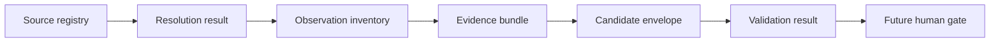

# Slice 1 Deterministic Contracts

## Purpose

Slice 1 fixes the persisted boundaries that later source resolution, manifest detectors,
evidence selection, model analysis, and Conductor orchestration must consume. It does not
implement those later stages.



All machine-consumed persisted artifacts use UTF-8 JSON. Producers serialize objects
with keys sorted, two-space indentation, and one trailing newline. Collections whose
order has no domain meaning are sorted before serialization.

## Persisted contracts

| Artifact | Schema | Operational validator |
| --- | --- | --- |
| Source registry | `schemas/source.schema.json` | `validate_source_registry` |
| Source resolution | `schemas/source-resolution.schema.json` | `validate_source_resolution` |
| Observation inventory | `schemas/observation.schema.json` | `validate_inventory` |
| Parsed manifest observation | `schemas/manifest-observation.schema.json` | `validate_manifest_observation` |
| API observation | `schemas/api-observation.schema.json` | `validate_api_observation` |
| Evidence bundle | `schemas/evidence-bundle.schema.json` | `validate_evidence_bundle` |
| Candidate envelope | `schemas/candidate-envelope.schema.json` | `validate_candidate_envelope` |
| Repository profile | `schemas/repository-profile.schema.json` | Candidate validation |
| Semantic claim | `schemas/claim.schema.json` | Candidate validation |

JSON Schema describes the portable shape. The dependency-free Python validators enforce
cross-field rules, stable identities, safe relative paths, non-descending line ranges,
bundle binding, and evidence rules that JSON Schema alone does not express.

## Manifest observation contract

Manifest detectors emit only literal observations available without executing a build
tool. They do not emit effective, resolved, or transitive dependency claims.

| Kind | Required value fields | Optional value fields |
| --- | --- | --- |
| `build-project` | `buildSystem`, `artifact` | `group`, `version`, `packaging` |
| `declared-dependency` | `buildSystem`, `group`, `artifact`, `scope`, `declaration` | `version` |
| `build-plugin` | `buildSystem`, `plugin`, `declaration` | `version` |
| `build-module` | `buildSystem`, `path` | None |
| `manifest-gap` | `buildSystem`, `code`, `detail` | None |

`buildSystem` is `maven` or `gradle`. `declaration` is `literal`,
`property-reference`, or `dynamic`. Every parsed manifest observation requires a safe
relative source path and exact line or line range. Source lines form part of the stable
observation identity.

When a declaration cannot be represented without evaluation or guesswork, the detector
emits `manifest-gap`. It must not silently omit the declaration or convert it into a
dependency observation.

## Registry and resolution contract

The canonical local registry is `sources.json`. Configured paths are absolute so command
behavior never depends on the current working directory. Registry exclusions are unique,
safe relative paths.

A successful resolution result records both configured and fully resolved paths, the
full source commit, sorted exclusions, sorted Copilot customization paths, their
canonical SHA-256 digest, and whether Copilot access has been approved. A later resolver
must fail closed for duplicate IDs or paths, disabled entries, non-root or dirty Git
repositories, path escapes, and invalid Copilot approvals.

## Evidence bundle identity

An evidence bundle contains:

- the repository ID, kind, and full commit;
- the SHA-256 digest of its validated observation inventory;
- bounded selected text with path, line range, content digest, and observation IDs;
- visible gaps and excluded paths.

The bundle `id` is the SHA-256 digest of its canonical JSON content after removing the
`id` field. Selected evidence is ordered by path and line range. Observation ID arrays
are sorted and unique.

## Candidate rules

A candidate envelope binds one proposed repository profile to one evidence bundle. The
profile repository, kind, and analyzed commit must equal the envelope and supplied
bundle. Candidate validation additionally requires:

- `confirmed` claims have direct evidence;
- `unknown` claims name missing evidence;
- claim evidence uses the envelope repository and commit;
- evidence references match a selected path, line range, and observation ID in the
  supplied bundle;
- claim IDs are unique;
- analysis timestamps include a timezone.

Candidates remain outside `catalog/`. Validation does not authorize promotion.

## Current CLI contract

```text
./tools/landscape preflight SOURCE
./tools/landscape discover SOURCE --repository ID [--output PATH]
./tools/landscape validate INVENTORY [--source SOURCE]
./tools/landscape status SOURCE --inventory INVENTORY
./tools/landscape sources validate REGISTRY
./tools/landscape sources resolve ID --registry REGISTRY
./tools/landscape evidence select INVENTORY --source SOURCE --output PATH
./tools/landscape candidate validate CANDIDATE --evidence BUNDLE
./tools/landscape catalog validate CATALOG
./tools/landscape topology validate TOPOLOGY --sources REGISTRY --catalog CATALOG
```

| Command outcome | Standard output | Standard error | Exit |
| --- | --- | --- | --- |
| Help | Human-readable help | Empty | `0` |
| Successful command | JSON, unless a command with `--output` writes the artifact | Empty | `0` |
| Dirty `preflight` | JSON result with `clean: false` | Empty | `2` |
| Unapproved Copilot customization | Resolution JSON with approval false | Empty | `2` |
| Invalid inventory | JSON result with `valid: false` | Empty | `1` |
| Operational or malformed-input failure | Empty | One `error:` line | `1` |
| Argument parsing failure | Empty | Usage and diagnostic | `2` |

`discover --output` and `evidence select --output` create missing parent directories and
produce no standard output. All JSON written by the current CLI is stable, sorted,
two-space-indented, and terminated by one newline.

## Candidate command contract

Slice 4 implements the remaining reserved consumer of the Slice 1 artifacts. Changing its
surface requires an explicit contract revision before a workflow consumes it.

```text
./tools/landscape candidate validate CANDIDATE --evidence BUNDLE
```

They must preserve the output and exit conventions above. Conductor workflow YAML must
consume these commands rather than duplicate validation, parsing, selection, or domain
logic.

## Representative fixtures

Valid and invalid examples live in `examples/contracts/`. Invalid fixtures are expected
to return one or more diagnostics and never raise an exception. Fixtures are synthetic;
paths, commits, digests, and statements do not describe private systems.

## Slice 1 completion gate

Slice 1 is complete when:

- every persisted boundary has a representative valid and invalid fixture;
- schema files and operational validators agree on field names and required values;
- stable IDs change when identity-bearing content changes;
- existing CLI behavior is covered through subprocess acceptance tests;
- repeated output is byte-for-byte stable;
- malformed artifacts fail closed;
- no source resolver, manifest parser, evidence selector, model runner, workflow, or
  promotion path has been introduced.
