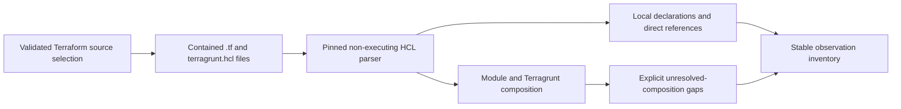

# Slice 10 Terraform and Terragrunt Declared-Composition Contract

## Purpose

Slice 10 defines a bounded static overview of one explicitly selected Terraform
application subtree. It records locally authored Terraform declarations, module
composition, direct syntactic references, and a narrow local Terragrunt composition
surface. It does not evaluate Terraform or Terragrunt and does not claim to reconstruct
the effective infrastructure produced by modules, inherited configuration, generated
files, variable values, dependency outputs, or provider behavior.

## Approved direction

The user selected Terraform analysis before the manual private pilot and deferred
OpenAPI and AsyncAPI YAML parity. The real landscape stores Terraform in a monorepo with
application subtrees shaped like `src/pro/services/{domain}/{app-name}`. Native `.tf`
files are common, while Terragrunt and reusable modules supply a material part of the
composition.

Version 1 intentionally provides a declared-composition overview. Effective resources
inside modules and effective values produced by Terragrunt remain unknown. This boundary
is more useful than a file inventory, while avoiding the false claim that static parsing
reproduces `terraform plan` or Terragrunt evaluation.

## Repository and source-selection boundary

The physical Terraform monorepo is registered once in the local `sources.json` with
`kind: terraform` and a path to the independent Git root. Application folders are not
registered as repositories. A validated source-topology artifact supplies one exact
`sourceSelections` entry with:

- an explicit stable selection ID;
- the registered Terraform repository ID;
- one safe relative subtree such as `src/pro/services/example-domain/example-app`; and
- `kind: terraform`.

Selection-scoped discovery requires `--topology` and `--selection` together. The selected
repository and selection must both have Terraform kind, the repository IDs must match,
and every path component must remain contained and non-symbolic. A scoped run executes
only the Git detector and the Terraform/Terragrunt detector; unrelated repository-wide
detectors do not sweep the monorepo.

The complete selection object is persisted in the observation inventory and evidence
bundle even when it produces no positive observation. Observations, gaps, exclusions,
and selected evidence must all remain at or below the selected subtree.

Terragrunt includes, dependency paths, and other references do not enlarge the selection.
A reference outside the selection remains a syntactic observation plus an unresolved
composition gap; the detector never follows it.

## Candidate and safety boundary

The detector considers only safe regular files below the exact selection:

| Candidate | Version 1 handling |
| --- | --- |
| Case-sensitive `*.tf` | Parse as native Terraform HCL |
| Exact case-sensitive `terragrunt.hcl` | Parse through the bounded Terragrunt surface |
| `override.tf` and `*_override.tf` | Parse and record `loadRole: override`; never compute precedence |
| `*.tf.json` | Emit one filename-derived `unsupported-terraform-json` gap without reading content |
| `*.tfvars`, `*.auto.tfvars`, `*.tfvars.json` | Exclude without reading as variable-value files |
| `.terraform.lock.hcl` | Ignore without reading; dependency-lock metadata is outside the vocabulary |
| Terraform state and backup state | Exclude without reading |
| Recognizable plan files | Exclude without reading |
| Other YAML, encrypted configuration, and unrelated files | Ignore without reading |

Existing excluded-directory, sensitive-name, generated-tree, vendor-tree, symlink,
readability, UTF-8, and 2 MiB file-size rules apply before parsing. `.terraform/`, module
caches, state, plans, variable-value files, dependency caches, generated code, vendor
trees, and encrypted or secret values are never inspected.

A generated `.tf` file outside a recognized excluded tree cannot be identified reliably
from syntax alone. Such files require a reviewed source exclusion; the detector must not
guess provenance from comments, paths, or naming.

## Parser boundary

Native Terraform and Terragrunt HCL use `python-hcl2==8.1.4` as the single direct parser
dependency. The detector uses its positioned HCL 2 parse-tree API only; it does not use
the package's query, evaluation, reconstruction, conversion CLI, or directory traversal
surfaces. `lark==1.3.1` and `regex==2025.9.18` are constrained transitive dependencies,
not detector APIs. Their constraints keep installation reproducible and retain Python
3.9 compatibility. A hand-written partial HCL parser or regular-expression fallback is
prohibited.

The package choice remains subject to the following implementation acceptance tests
against synthetic fixtures:

1. complete parsing of the accepted HCL 2 syntax without evaluation;
2. exact physical source ranges for blocks, labels, attributes, object keys, and
   expression traversals;
3. deterministic output and deterministic malformed-input behavior;
4. no implicit file loading, include resolution, module resolution, plugin loading,
   subprocess execution, environment lookup, or network access;
5. bounded behavior for deeply nested or oversized syntax; and
6. support for Python 3.9 or later under the repository's dependency policy.

The acceptance tests must also prove that the parser's package-local Lark grammar cache
never writes inside an analyzed repository and fails safely in a read-only installation.
If the pinned parser fails any gate, implementation must stop and return to contract
research; the detector must not substitute Python's `re`, the third-party `regex`
package, or another partial parser. Parser exception text is never persisted.

## Deterministic parser limits

Version 1 freezes these upper bounds per selection or file:

| Boundary | Limit |
| --- | ---: |
| Candidate files per selection | 4,096 |
| File size | 2 MiB |
| HCL nesting depth per file | 64 |
| Parsed syntax nodes per file | 50,000 |
| Blocks per file | 4,096 |
| Attributes per file | 16,384 |
| Direct reference traversals per file | 50,000 |

Crossing a file-count limit excludes deterministically sorted remaining paths. Crossing a
per-file syntax limit emits one fixed resource-limit gap and suppresses every positive
observation from that file. These limits constrain deterministic parsing; the existing
smaller evidence-bundle file, range, line, and byte limits continue independently.

## Observation vocabulary

All observations carry the repository ID, full commit, detector name and version, safe
repository-relative path, exact non-descending physical line range, and explicit source
selection ID. Observation identity continues to include the complete value and source
range.

### Terraform declarations

`terraform-declaration` records only declaration identity, never evaluated values.

| Declaration | Required identity | Notes |
| --- | --- | --- |
| `terraform` | `declarationType: terraform` | Records the block only |
| `resource` | `declarationType`, literal type label, literal name label | Does not imply an instance exists |
| `data` | `declarationType`, literal type label, literal name label | Does not imply successful lookup |
| `module` | `declarationType`, literal name label | Effective child resources remain unknown |
| `provider` | `declarationType`, literal provider label | Alias values are not evaluated |
| `variable` | `declarationType`, literal name label | Defaults and supplied values are not persisted |
| `output` | `declarationType`, literal name label | Output values are not persisted |
| `local` | `declarationType`, literal attribute key | Local expression values are not persisted |

Every declaration also records `language: terraform-hcl`, `loadRole` as `ordinary` or
`override`, and `sourceSelectionId`. Repeated syntactic declarations remain distinct by
path and source range; the detector does not apply Terraform uniqueness or override
semantics.

### Direct syntactic references

`terraform-reference` records only direct HCL traversal roots exposed by the parser:

| Reference type | Accepted identity shape |
| --- | --- |
| Managed resource | `<type>.<name>` |
| Data source | `data.<type>.<name>` |
| Module | `module.<name>` |
| Variable | `var.<name>` |
| Local | `local.<name>` |

The observation preserves the syntactic identity and source range, but it does not
resolve scopes, attributes, instances, aliases, modules, values, or relationships. A
reference is not proof that the target exists or that the expression is evaluated.

### Declared composition

`terraform-composition` uses one of these exact forms:

| Form | Recorded fields | Boundary |
| --- | --- | --- |
| `terraform-module-source` | module name and exact literal source | Source is never opened or resolved |
| `terragrunt-terraform-source` | exact literal source | Source is never opened or resolved |
| `terragrunt-include` | optional literal block label | Include path or expression is not followed |
| `terragrunt-dependency` | literal block label | Dependency config and outputs are not read |
| `terragrunt-input-key` | literal input key only | Input value is never persisted or selected as source text |

All composition observations record `language` as `terraform-hcl` or
`terragrunt-hcl`, plus `sourceSelectionId`. Literal module and Terraform source strings
are preserved because they identify declared composition. They are evidence of a source
declaration only, not module availability, contents, provenance, or use.

## Terragrunt boundary

Only the selected subtree's local `terragrunt.hcl` files are parsed. Version 1 recognizes
top-level `terraform`, `include`, `dependency`, `dependencies`, and `inputs` structures
only far enough to emit the composition vocabulary above.

The detector never:

- follows `include` or `dependency` paths;
- evaluates functions, interpolation, locals, expressions, or folder-derived values;
- reads dependency outputs or mock outputs;
- processes `generate` or `remote_state` content;
- reads variable-value files;
- searches parent directories for configuration;
- runs Terragrunt or Terraform; or
- contacts module sources, registries, state backends, providers, or network services.

Every recognized module, include, dependency, or inputs surface that requires resolution
also produces an explicit fixed unresolved-composition gap. This prevents the inventory
from being mistaken for effective infrastructure.

## Gap vocabulary

`terraform-gap` records `context`, `form`, fixed `code`, fixed detector-owned `detail`,
`sourceSelectionId`, and exact source location. Gap details never contain source values,
parser exceptions, paths obtained from expressions, dependency outputs, or secret data.

| Code | Meaning |
| --- | --- |
| `malformed-hcl` | A candidate is not valid HCL under the pinned parser |
| `terraform-parser-resource-limit` | A frozen parser or selection limit was exceeded |
| `unsupported-terraform-json` | A `.tf.json` candidate is identified but not parsed |
| `unsupported-terraform-block` | A Terraform top-level block has no version 1 declaration contract |
| `unsupported-terragrunt-construct` | A Terragrunt construct is outside the bounded surface |
| `dynamic-module-source` | A module source is absent, non-literal, or expression-derived |
| `dynamic-terragrunt-source` | A Terragrunt Terraform source is absent, non-literal, or expression-derived |
| `unresolved-module-implementation` | Resources created by a declared module are intentionally not inspected |
| `unresolved-terragrunt-include` | Included configuration is intentionally not followed |
| `unresolved-terragrunt-dependency` | Dependency configuration and outputs are intentionally not followed |
| `unresolved-terragrunt-input` | Input values are intentionally omitted or require evaluation |
| `dynamic-instance-shape` | `count` or `for_each` prevents a literal instance shape |
| `dynamic-block-content` | A dynamic block can generate structure not represented by local declarations |
| `unsupported-reference-expression` | An expression cannot be represented as a supported direct traversal |
| `sensitive-value-withheld` | Structural metadata was recorded while source text was withheld by policy |

Malformed HCL, parser resource exhaustion, and unsafe syntax-location failures are
file-fatal: one gap is emitted and no positive observation from that file survives.
Unsupported independent blocks or expressions produce local gaps while independent safe
declarations continue.

## Privacy-preserving evidence behavior

The inventory may retain structural identifiers and approved literal module source
declarations. Evidence selection must not copy potentially sensitive values merely
because their structural key was observed.

| Observation | Evidence behavior |
| --- | --- |
| Block declarations whose complete physical line contains only the parser-proven block header and insignificant whitespace | Select that complete line |
| Literal module or Terragrunt Terraform source whose complete physical line contains only the parser-proven assignment and insignificant whitespace | Select that complete line |
| Direct reference traversal | Inventory only; do not select the containing expression text |
| Local declaration key | Inventory only; do not select its value expression |
| Terragrunt input key | Inventory only; do not select its value expression |
| Any Terraform or Terragrunt gap | Route only the fixed gap metadata; never select source text |

Every Terraform/Terragrunt positive records a validated `evidenceDisposition` of either
`raw-text-safe` or `inventory-only`. The detector assigns `raw-text-safe` only when its
positioned parser tokens prove that the approved span covers the entire physical line
apart from insignificant whitespace. Comments, additional attributes, expressions,
input/default values, and unrelated tokens make the observation `inventory-only`.
Inventory-only observations remain traceable by commit, path, and exact line but are
represented in the evidence bundle through a fixed `sensitive-value-withheld` gap rather
than selected source content. Candidate validation must not permit a semantic claim to
cite source text that was not selected. This is an evidence restriction, not an HCL
syntax restriction: valid HCL remains inventoryable even when its source cannot be
safely selected.

## Semantic boundary

Observations mean only that supported checked-in syntax exists at the recorded repository
commit, selection, path, and lines. They do not establish:

- effective Terraform or Terragrunt configuration;
- resources created by a module;
- resource count, addresses, provider selection, or dependency order;
- infrastructure existence, deployment, access, ownership, health, security, cost, or
  provenance;
- module availability, downloaded content, version selection, or integrity;
- state, plan, drift, outputs, secrets, credentials, or runtime behavior; or
- cross-repository or application relationships beyond separately reviewed topology.

The overview must use wording such as `declared module`, `local declaration`, `direct
syntactic reference`, and `unresolved composition`. It must never use `implemented
resource`, `deployed`, `managed`, or `effective` for module-derived infrastructure.

## Contract acceptance gate

Implementation may begin only after separate authorization and after all of these are
prepared for review:

1. `python-hcl2==8.1.4`, with the constrained `lark==1.3.1` and
   `regex==2025.9.18` transitive dependencies, passes the parser boundary without
   network or source execution;
2. portable schemas and dependency-free operational validators agree for every new
   observation and selection shape;
3. synthetic Terraform and Terragrunt fixtures cover every positive form and fixed gap;
4. fixtures prove `.tfvars`, state, plans, caches, encrypted files, generated/vendor
   trees, symlinks, and out-of-selection references are never read;
5. exact lines, stable IDs, resource limits, override labels, and deterministic repeated
   output are tested;
6. privacy-preserving evidence tests prove input/default/expression values cannot enter
   selected source text;
7. existing Kubernetes selection behavior and all earlier detector outputs remain
   compatible;
8. focused tests, portable Draft 2020-12 schema parity, and the complete deterministic
   suite pass; and
9. independent read-only review has no unresolved correctness, privacy, or safety finding.

Contract approval and parser selection do not authorize implementation,
private-repository access, dependency installation, commit, or push.
