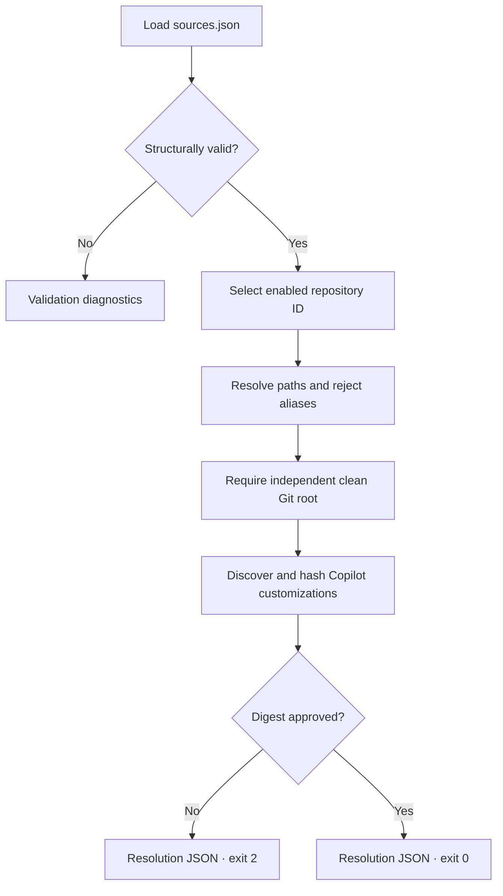

# Slice 2 Source Resolution

## Purpose

Slice 2 turns the source-registry contracts into a deterministic trust boundary. It
validates registry structure and resolves one registered repository without modifying or
executing anything from that repository.



## Commands

```text
./tools/landscape sources validate REGISTRY
./tools/landscape sources resolve ID --registry REGISTRY
```

`sources validate` reads only the registry. It emits `{"valid": true, "errors": []}`
with exit `0`, or ordered validation diagnostics with exit `1`. Malformed JSON and file
I/O errors are operational failures on standard error with exit `1`.

`sources resolve` emits a `source-resolution.schema.json` document. Exit `0` means the
source is safe and Copilot access is approved. Exit `2` means the source is otherwise
safe but its current Copilot customization digest requires review. Operational or safety
failures use standard error and exit `1`.

## Registry validation

The registry must satisfy all of these rules before resolution:

- `schemaVersion` is `1` and only documented fields are present;
- repository IDs use lowercase kebab-case and are unique;
- configured paths are absolute, contain no `..` component, and are unique;
- repository kinds and enabled flags are valid;
- repositories are sorted by ID;
- exclusions are sorted, unique, safe relative paths;
- an optional approved Copilot digest is a lowercase SHA-256 value.

Validation is structural and does not require configured repositories to exist. This
keeps registry review separate from local-machine availability.

## Resolution checks

Resolution additionally requires:

1. No two registry entries resolve to the same canonical path, including symbolic-link
   aliases.
2. The requested ID exists and is enabled.
3. The configured root exists, is a directory, and is not itself a symbolic link.
4. The resolved path is an independent Git repository root with a clean working tree.
5. The source is not the `bounded-knowledge` observatory repository.
6. Every recognized Copilot customization is contained inside the repository, is a
   regular file, is no larger than the discovery file limit, and has no symbolic-link
   component in a customization tree.
7. Files containing `@` in `AGENTS.md`, `CLAUDE.md`, or
   `.github/copilot-instructions.md` are conservatively rejected before any referenced
   content is read. The current approval digest does not yet model recursive
   instruction-file references, so accepting them would leave referenced sensitive or
   changed content outside the trust boundary. This may also reject non-reference uses
   such as email addresses; that limitation is intentional and visible.

No build, test, hook, wrapper, application script, or source-owned executable is run.
The only subprocesses are read-only Git metadata commands issued by the observatory.

## Copilot customization approval

The resolver detects repository customization surfaces supported by GitHub Copilot CLI:

- `AGENTS.md`, `CLAUDE.md`, and `GEMINI.md` throughout non-excluded source paths;
- `.github/copilot-instructions.md`;
- files below `.github/instructions`, `.github/agents`, and `.github/skills`;
- files below `.claude/agents`, `.claude/skills`, and `.agents/skills`.

This follows the current GitHub documentation for
[Copilot CLI custom instructions](https://docs.github.com/en/copilot/how-tos/copilot-cli/customize-copilot/add-custom-instructions),
[custom agents](https://docs.github.com/en/copilot/how-tos/copilot-cli/use-copilot-cli/invoke-custom-agents),
and [agent skills](https://docs.github.com/en/copilot/how-tos/copilot-cli/customize-copilot/add-skills).

The digest is deterministic. For each sorted relative path, the resolver hashes:

```text
UTF-8 relative path
NUL byte
raw SHA-256 digest of file bytes
NUL byte
```

The digest of an empty customization set is the standard SHA-256 digest of empty input.
When no customizations exist, Copilot access is approved without a registry digest. When
one or more exist, `approvedCopilotConfigurationSha256` must exactly match the computed
digest. A mismatch returns the complete file list and computed digest for human review,
sets `copilotAccessApproved` to `false`, and exits `2`.

Approval covers repository-owned customizations only. A later Copilot execution slice
must control user-level instructions and environment-configured customization directories
separately; they are not source-registry inputs.

## Output stability

Resolution output records:

- repository ID and kind;
- configured and canonical paths;
- full Git commit SHA;
- sorted exclusions;
- sorted Copilot customization paths;
- customization digest and approval state.

The same registry and unchanged repository commit produce byte-for-byte identical CLI
output.

## Slice 2 completion gate

Slice 2 is complete when structural validation and resolution are available through the
documented CLI, all safety failures fail closed, unapproved customizations produce a
reviewable exit-2 result, source repositories remain unchanged, and no manifest parsing
or evidence selection has been introduced.
