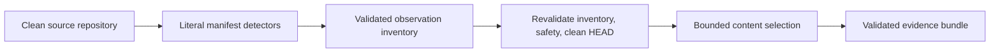

# Slice 3 Manifest Extraction and Evidence Selection

## Purpose

Slice 3 adds bounded, literal Maven and Gradle inspection and turns a validated
observation inventory into a deterministic evidence bundle. It never executes a build
tool, wrapper, plugin, hook, or source-owned script.



## Manifest detectors

| Input | Literal observations | Visible gaps |
| --- | --- | --- |
| Maven `pom.xml` | project coordinates, direct dependencies, direct build plugins, modules | malformed or unsafe XML, parent/effective model, profiles, dependency/plugin management, omitted effective fields, unsupported sections or fields |
| Gradle build scripts | literal string dependencies and plugin IDs in supported Groovy/Kotlin forms | computed calls, catalogs, unsupported coordinates, nested dynamic scopes, unknown syntax |
| Gradle settings | literal root project name and literal `include` modules | computed/unsafe modules, composite builds, plugin or dependency-resolution management |

Property references remain verbatim. Maven `${property}` values and Gradle `$property`
or `${property}` strings use `declaration: property-reference`; no value is resolved.
Maven dependency scope omitted from the manifest is recorded as `unspecified` alongside
an `inherited-default-scope` gap. Omitted dependency/plugin versions and plugin groups
also produce effective-model gaps.

Maven line ranges come from the standard-library Expat parser. Gradle extraction is
line-oriented and accepts only explicitly recognized literal forms. Unsupported forms
produce `manifest-gap` observations rather than guessed declarations.

## Evidence command

```text
./tools/landscape evidence select INVENTORY --source SOURCE --output PATH
```

`SOURCE` is an independent source-repository root. The command:

1. parses and operationally validates the inventory;
2. validates all referenced source paths against the repository;
3. requires a clean working tree;
4. checks that source `HEAD` still equals the inventory commit immediately before
   selected content reads;
5. rejects symbolic links, unsafe paths, excluded files, oversized files, and non-UTF-8
   content;
6. selects exact observed ranges when present and bounded leading content otherwise;
7. validates the completed bundle against the Slice 1 operational contract before
   writing it.

The command creates missing output parent directories, writes stable formatted JSON,
emits no standard output on success, and exits `1` with one `error:` line for malformed,
stale, dirty, or unsafe input. Validation failures occur before the output is written.

## Selection bounds

| Boundary | Slice 3 limit |
| --- | ---: |
| Source file size | 2 MiB |
| Selected source paths | 64 |
| Selected ranges per source path | 16 |
| Lines per selected range | 200 |
| UTF-8 content per selected range | 16 KiB |
| UTF-8 content in one bundle | 256 KiB |

Truncation produces a `content-truncated` gap. Paths omitted by file, range, or total
limits appear in `excluded` with a stable selection-limit reason. Selection order is
source path and line range; observation ID arrays are sorted and unique.

The inventory digest is SHA-256 over compact canonical JSON with sorted keys. Each
selected content digest is SHA-256 over the exact UTF-8 content in the bundle. The
bundle ID follows the Slice 1 canonical identity rule after all content, gaps, and
exclusions have been finalized.

The Slice 1 command has no explicit source kind input. For this slice only, inventories
containing a literal Maven or Gradle build observation use bundle kind `application`;
other inventories use `other`. A later contract revision should bind the registry's
reviewed kind when evidence selection is integrated with source-resolution artifacts.

## Safety and known gaps

- XML DTD declarations are rejected; external resources are never loaded.
- Maven effective POMs, transitive dependencies, active profiles, interpolation, and
  lifecycle execution are not evaluated.
- Gradle scripts are not parsed as a full Groovy/Kotlin language. Multi-line, named-map,
  catalog, platform, project, function-call, and plugin-management declarations remain
  visible gaps unless covered by a documented literal form.
- Slice 3 does not invoke Copilot, add workflows, validate candidates, analyze private
  repositories, or promote canonical knowledge.
