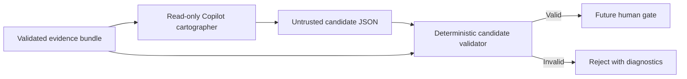

# Slice 4 Candidate Validation and Direct Copilot Trial

## Purpose

Slice 4 makes model output operationally untrusted. A read-only Copilot cartographer may
propose a repository profile from one bounded evidence bundle, but deterministic validation
must accept the candidate before any later human gate or promotion stage can consume it.



This slice does not add Conductor, mutate `catalog/`, or authorize promotion.

## Candidate command

```text
./tools/landscape candidate validate CANDIDATE --evidence BUNDLE
```

Both inputs are UTF-8 JSON files. A valid candidate produces
`{"errors": [], "valid": true}` on standard output and exit `0`. Contract or binding
errors produce ordered diagnostics on standard output and exit `1`. Malformed JSON and
file I/O failures produce one `error:` line on standard error and exit `1`.

The supplied evidence bundle is validated before it is used as a trust boundary. An
invalid bundle cannot make a candidate valid.

## Deterministic rules

The validator connects `candidate-envelope.schema.json`, `repository-profile.schema.json`,
and `claim.schema.json` to the selected bundle and enforces these additional rules:

| Area | Required invariant |
| --- | --- |
| Envelope | Repository, kind, commit, and evidence-bundle ID match the supplied bundle. |
| Profile | Repository, kind, and analyzed commit match the envelope. |
| Claims | IDs are unique; statuses and confidence values are supported; timestamps include a timezone. |
| Confirmed or inferred | At least one verifiable evidence reference is present. |
| Unknown | `missingEvidence` contains a specific non-empty question or gap. |
| Evidence identity | Repository and commit match the envelope; path and observation ID occur together in one selected entry. |
| Evidence range | The cited line or range is contained by that selected entry's range. |
| Counterevidence | The same identity and range checks apply as for supporting evidence. |

Evidence references require both `lines` and `observationId` at this consumer boundary,
even though the reusable claim schema permits omitting them. Without both values, the
reference cannot be verified against the selected bundle and fails closed.

## Read-only cartographer

`.github/agents/repository-cartographer.agent.md` exposes only Copilot's `view` tool. Its
instructions restrict analysis to the explicitly named evidence bundle and require raw
candidate JSON. It cannot edit files, execute commands, browse URLs, or inspect the source
repository.

Run a direct trial from the observatory root after producing an evidence bundle:

```text
copilot -C "$PWD" \
  --agent repository-cartographer \
  --available-tools=view \
  --disable-builtin-mcps \
  --disallow-temp-dir \
  --no-ask-user \
  --no-remote \
  --no-remote-export \
  --silent \
  --prompt "Analyze only work/REPOSITORY.evidence.json. Return exactly one candidate JSON object and no prose or Markdown. The first output character must be { and the last must be }. Use ANALYZED_AT for every analyzedAt value." \
  > work/REPOSITORY.response.txt

./tools/landscape candidate extract \
  work/REPOSITORY.response.txt \
  --output work/REPOSITORY.candidate.json

./tools/landscape candidate validate \
  work/REPOSITORY.candidate.json \
  --evidence work/REPOSITORY.evidence.json
```

The shell owns the raw-response redirection; Copilot has no write tool. `candidate
extract` requires exactly one JSON object in that response, rejects zero or multiple
objects, and writes stable JSON. It does not make the object trusted; the following
candidate validation remains mandatory. The CLI flags also
disable built-in MCP access, temporary-directory access, follow-up questions, and remote
session control. Do not add `--allow-all`, `--allow-all-tools`, or `--allow-all-paths`.

GitHub Copilot CLI `1.0.83` was observed to prepend a progress sentence even with
`--silent` and explicit JSON-only instructions. Preserve that raw response and use the
deterministic extraction step instead of shell text filtering.

When running through an execution harness, first distinguish harness credential
isolation from a real login failure. In the validated local setup, the sandboxed process
could not see Copilot authentication while the same view-only command succeeded outside
the harness sandbox. Grant only the single bounded Copilot command the minimum required
host access; do not broaden the cartographer's tools or readable paths.

## Completion gate

Slice 4 is complete when response extraction and candidate validation are fixture- and
CLI-tested, zero or multiple response objects and all identity or evidence-reference
mismatches fail closed, candidate output remains outside canonical directories, and
direct read-only trials against both synthetic repositories produce extracted candidates
that pass the deterministic validator. Conductor and promotion remain deferred.
