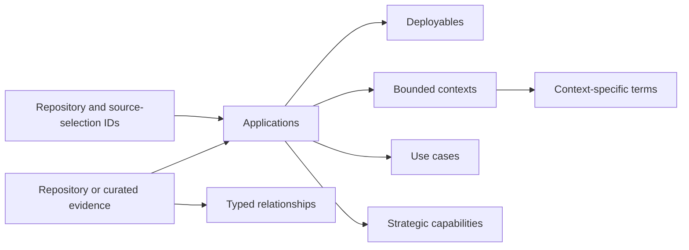

# Slice 5A Canonical Knowledge Model

## Purpose

Slice 5A defines the minimum durable catalog needed to represent reviewed business and
domain knowledge about the application landscape. It separates logical applications from
their deployables, keeps terms inside bounded contexts, connects applications to use cases
and strategy, and makes every entity and relationship an evidence-backed assertion.



The portable contract is `schemas/landscape-catalog.schema.json`. The schema version is
`1`. Version 1 is intentionally narrow; later additions require an explicit contract
revision rather than unstructured extension fields.

## Canonical entities

| Collection | Meaning | Minimum content |
| --- | --- | --- |
| `applications` | Business or operational systems recognized by the organization | Name, purpose, assessment |
| `deployables` | Independently deployed services, workers, jobs, functions, or scheduled processes | Name, kind, assessment |
| `boundedContexts` | Boundaries within which domain language is consistent | Name, description, assessment |
| `useCases` | Actor goals and business outcomes | Name, actor, outcome, assessment |
| `terms` | Context-specific expressions and definitions | Name, definition, assessment |
| `strategicCapabilities` | Human-supplied objectives, capabilities, principles, constraints, or initiatives | Statement, desired outcomes, assessment |

Applications and deployables expose stable IDs for the parallel source-topology contract
to reference. They do not embed repository or source-selection bindings. Physical
repository IDs, selection IDs, subpaths, selectors, and ownership inference belong to the
topology contract, preventing circular validation and dual ownership of mappings.

Application and deployable remain separate identities even when the usual relationship is
one-to-one. The fixture demonstrates one application comprising both an API service and a
scheduled worker. It also defines the Customer Management application and Customer API
deployable referenced by the parallel topology fixture, so that fixture's shared
Kubernetes selection can bind to two valid catalog applications and deployables.

## Typed relationships

| Relationship type | Source | Target |
| --- | --- | --- |
| `application-comprises-deployable` | Application | Deployable |
| `application-participates-in-bounded-context` | Application | Bounded context |
| `application-supports-use-case` | Application | Use case |
| `bounded-context-defines-term` | Bounded context | Term |
| `application-contributes-to-strategic-capability` | Application | Strategic capability |

The schema constrains endpoint kinds for every relationship type. The deterministic
validator also verifies that each `entityId` exists in the matching collection and that
entity and relationship IDs are globally unique.

Terms deliberately do not carry a bare `contextId`. Their context is expressed by an
evidence-backed `bounded-context-defines-term` relationship. This permits an unresolved
term to remain visible without silently assigning it to a context and permits competing
context assignments to retain their evidence and counterevidence.

## Evidence and confidence

Every entity and relationship has an `assessment` with:

- timezone-aware `analyzedAt` provenance;
- `status`: `confirmed`, `inferred`, or `unknown`;
- `confidence`: `high`, `medium`, or `low`;
- supporting `evidence` and separate `counterevidence` arrays;
- `missingEvidence` when status is `unknown`.

`confirmed` and `inferred` assessments require at least one evidence record. `unknown`
assessments require at least one explicit missing-evidence statement. Counterevidence is
never folded into supporting evidence or discarded during promotion.

Repository evidence references topology only through a stable repository ID and optional
stable source-selection ID; it also preserves a full commit SHA, source path, and, when
practical, lines and an observation ID. Curated evidence records an interview,
document, or approved reference together with its stable source ID, supplier, capture
timestamp, and optional locator. Strategy must use curated evidence; it is never inferred
from source code alone.

This JSON Schema validates portable shape and local status requirements. The dependency-
free `validate_landscape_catalog` operational validator additionally checks exact fields,
safe repository evidence paths, explicit time zones, deterministic ordering, global ID
uniqueness, relationship endpoint types, and referential integrity. Binding repository
evidence to selected excerpts and checking line containment remain later integration work.

Run it through the stable CLI surface:

```text
./tools/landscape catalog validate CATALOG
```

Valid input produces `{"errors": [], "valid": true}` with exit `0`. Contract or
reference errors produce ordered validation JSON with exit `1`. Malformed JSON and file
I/O failures produce one `error:` line on standard error with exit `1`.

## Deterministic serialization and ordering

Producers write UTF-8 JSON with lexicographically sorted object keys, two-space indentation,
and one trailing newline. Arrays are ordered as follows before serialization:

| Array | Ordering rule |
| --- | --- |
| Entity collections | Ascending entity `id` |
| `relationships` | Ascending `(type, id)` |
| `evidence`, `counterevidence` | Repository evidence by `(kind, repositoryId, commit, path, lines, observationId, sourceSelectionId)`; curated evidence by `(kind, sourceId, sourceType, recordedAt, locator, suppliedBy)` |
| `desiredOutcomes`, `missingEvidence`, root `openQuestions` | Lexicographic order; unique |

JSON Schema enforces uniqueness where scalar arrays support it. The operational validator
enforces ordering, ID uniqueness, evidence-reference shape, and duplicate relationship
identity before later promotion.

## Deliberate exclusions

Version 1 does not model interfaces, contract elements, modules, data stores, Kubernetes,
Terraform, AWS resources, runtime observations, co-change history, teams, findings, or
detailed architecture classifications. It also does not define promotion or modify the
existing repository-profile candidate. Those concerns require their own evidence contracts
and explicit schema-version revisions after the manual pilot establishes their useful
shape.

The absence of runtime evidence is not evidence of non-use. Version 1 therefore contains
no `unused` or runtime-usage state.

## Fixtures and completion boundary

`examples/contracts/landscape-catalog.valid.json` demonstrates:

- one application with multiple deployables;
- two applications and their deployables for the topology fixture's shared-folder case;
- context-specific terms, including an unresolved term;
- a curated application-to-strategy mapping;
- repository and curated evidence;
- counterevidence and explicit open gaps.

`examples/contracts/landscape-catalog.invalid.json` fails for several independent reasons:
an invalid stable ID, a confirmed assertion without evidence, an unknown assertion without
`missingEvidence`, and relationship endpoint kinds that contradict its type.

Slice 5A provides the portable canonical shape and standalone operational validation.
Candidate formats, evidence-bundle binding, human-review diffs, and single-writer promotion
remain separate later work.
