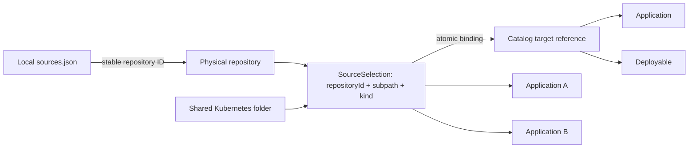

# Slice 5A Source Topology Contract

## Purpose

Slice 5A separates physical Git repositories and logical source selections from the
application and deployable catalog they describe. It introduces a path-independent
persisted contract for mapping application source repositories and subpaths of shared
Kubernetes, Terraform, pipeline, or other repositories to externally defined catalog
targets.



This slice does not define applications, deployables, relationships between them, bounded
contexts, terms, use cases, interfaces, contract elements, data stores, infrastructure
resources, teams, strategic capabilities, or findings. Those concepts belong to the
separate landscape catalog and later evidence and review contracts.

## Persisted artifact

| Artifact | Schema | Valid fixture | Invalid fixture |
| --- | --- | --- | --- |
| Source topology | `schemas/source-topology.schema.json` | `examples/contracts/source-topology.valid.json` | `examples/contracts/source-topology.invalid.json` |

The artifact uses `schemaVersion: 1`. Every object has an exact field set and rejects
additional properties. All entity and referenced IDs use lowercase kebab-case.

## Entity boundaries

| Entity | Required fields | Meaning |
| --- | --- | --- |
| `Repository` | `id`, `kind` | A physical Git root registered under the same stable ID in local `sources.json` |
| `SourceSelection` | `id`, `repositoryId`, `subpath`, `kind` | A repository root or safe logical subtree; `.` denotes the repository root |
| `Target` | `type`, `id` | A reference to an `application` or `deployable` defined in the separate landscape catalog |

Repository entries intentionally contain no filesystem path. Machine-specific absolute
paths remain in the user-owned local registry. A shared monorepo folder is represented by
one `SourceSelection` and may be bound to several applications or deployables.

`SourceSelection` identity is the tuple `repositoryId + subpath + kind`; its stable `id`
provides a compact reference for bindings. Subpaths are relative, use `/` separators, do
not contain empty, `.` or `..` segments, and never start with `/`. The single value `.`
represents the repository root.

## Atomic bindings

The single `bindings` collection maps one `sourceSelectionId` to one catalog `target`.
Repeating a selection in several bindings or a target in bindings for several selections
creates a many-to-many topology without duplicating catalog entities or application-to-
deployable ownership rules here.

### Status and provenance

Every binding records both `status` and `provenance`:

| Status | Meaning | Expected provenance method |
| --- | --- | --- |
| `declared` | A human explicitly supplied the mapping | `manual` |
| `inferred` | A naming convention proposed the mapping and review is still required | `folder-convention` |

`provenance.detail` is a non-empty explanation of how the mapping was obtained. An
inferred binding does not become confirmed merely because the referenced folder exists.
The schema requires `declared` with `manual` and `inferred` with `folder-convention` so
contradictory combinations fail closed.

## Deterministic serialization and validation

Producers serialize UTF-8 JSON with keys sorted, two-space indentation, and one trailing
newline. Arrays are sorted as follows because their order has no domain meaning:

| Collection | Sort key |
| --- | --- |
| `repositories`, `sourceSelections` | `id` |
| `bindings` | `sourceSelectionId`, then `target.type`, then `target.id` |

JSON Schema enforces portable shape, exact fields, identifier syntax, supported enum
values, safe relative-path syntax, and agreement between binding status and provenance
method. The dependency-free `validate_source_topology` operational validator also enforces:

- unique entity IDs and unique `SourceSelection` identity tuples;
- repository IDs exist in the validated local registry and kinds agree;
- every binding selection resolves within the topology and every target resolves in the
  separately validated landscape catalog;
- binding endpoint pairs are unique;
- arrays follow the deterministic ordering above;
- source selections do not target a subtree excluded by the local source registry.

Run the complete cross-artifact validation through:

```text
./tools/landscape topology validate TOPOLOGY --sources REGISTRY --catalog CATALOG
```

The command validates the source registry and catalog before topology references. It is
lexical and read-only: it does not resolve filesystem paths, follow symlinks, or inspect a
source repository. Resolved-path and symlink containment belong to a future command that
consumes an approved source-resolution artifact.

## Representative mappings

The valid fixture demonstrates both required shapes:

1. Normal atomic mappings from application repository roots and one explicit Terraform
   subtree to application or deployable catalog IDs.
2. A Kubernetes selection at `apps/team-shared/workloads` bound to two applications and
   two deployables with visible `inferred` provenance.

The invalid fixture intentionally contains uppercase IDs, an unsupported `confirmed`
mapping status, and a descending `../secrets` subpath. Consumers must reject it rather
than normalize it silently.
