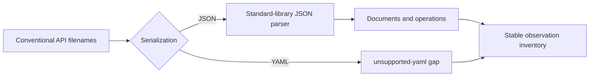
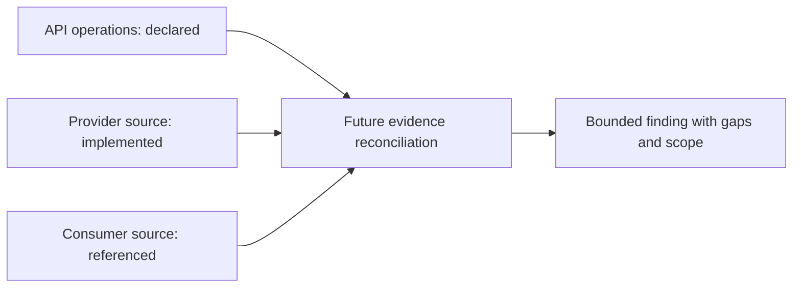

# Slice 6 OpenAPI and AsyncAPI Inventory Contract

## Purpose

Slice 6 defines the first deterministic interface detector. Version 1 structurally
parses conventionally named OpenAPI and AsyncAPI JSON files and records conventionally
named YAML files as visible unsupported gaps. It does not claim that an operation is
implemented, referenced, reachable, or used at runtime.

## Candidate boundary

The detector considers only case-insensitive basenames `openapi.json`, `asyncapi.json`,
`openapi.yaml`, `openapi.yml`, `asyncapi.yaml`, and `asyncapi.yml`, plus names ending in
`.openapi.<extension>` or `.asyncapi.<extension>` for the same three extensions. It does
not inspect every JSON or YAML file looking for a specification marker.

The filename is a candidate hint, not proof of a specification. A JSON file becomes an
API document only after exactly one root `openapi` or `asyncapi` string marker is parsed.
Missing, conflicting, or malformed markers produce a stable `api-gap`. A YAML candidate
produces exactly one `unsupported-yaml` gap using the specification implied by its
conventional filename; its contents are not parsed.

## Observation vocabulary

Every observation has a safe repository-relative source path and an exact,
non-descending source line or line range. `schemas/api-observation.schema.json` defines
the portable shape; the operational validator additionally enforces safe paths, line
ordering, kind/value pairing, and the rules below.

| Kind | Required value fields | Optional value fields |
| --- | --- | --- |
| `api-document` | `specification`, `serialization`, `specificationVersion` | `title` |
| OpenAPI `api-operation` | `specification`, `operationType`, `action`, `target` | `operationId` |
| AsyncAPI 2.x `api-operation` | `specification`, `operationType`, `action`, `target` | `operationId` |
| AsyncAPI 3.x `api-operation` | `specification`, `operationType`, `operationKey`, `action`, `target` | None |
| `api-gap` | `specification`, `serialization`, `code`, `detail` | None |

`specification` is `openapi` or `asyncapi`, except that a JSON gap may use `unknown`
when root markers conflict. `serialization` is `json` or `yaml`. YAML produces gaps
only; version 1 never emits YAML document or operation observations.

## Supported JSON structure

The version policy is OpenAPI `3.0.<patch>`, `3.1.<patch>`, and `3.2.<patch>`, and
AsyncAPI `2.<minor>.<patch>` and `3.<minor>.<patch>`, with non-negative integer
components. The parser preserves the complete root value as `specificationVersion`.
A recognized document outside that policy produces `api-document` plus
`api-gap: unsupported-version`; deeper extraction does not continue.

An OpenAPI operation uses `operationType: http`, preserves a supported lowercase HTTP
method as `action`, and records the literal path-template map key as `target`. Supported
actions are `delete`, `get`, `head`, `options`, `patch`, `post`, `put`, `query`, and
`trace`. A literal `operationId` is optional.

An AsyncAPI 2.x operation uses `operationType: channel`, preserves `publish` or
`subscribe`, and records the containing literal channel key as `target`. A literal
`operationId` is optional. An AsyncAPI 3.x operation preserves the root `operations`
map key as `operationKey`, preserves `send` or `receive`, and records the operation's
literal channel `$ref` as `target`. It does not represent the root map key as
`operationId` and does not resolve the channel reference.

The detector does not inventory components or general `$ref` values in version 1. Those
remain a later contract revision rather than partially supported observations.

## JSON failure behavior

| Condition | Result |
| --- | --- |
| Malformed JSON, non-object root, or duplicate object key | One fixed-message gap; do not extract deeper structure |
| Missing or conflicting root marker | One fixed-message gap; do not extract deeper structure |
| Unsupported specification version | Document observation plus gap; do not extract operations |
| Unsupported or malformed operation subtree | Gap at the affected declaration; continue only with independent operations |
| Dynamic, missing, or non-string AsyncAPI 3 channel `$ref` | Gap for that operation; do not invent a target |

Duplicate keys are rejected during parsing. Gap details are detector-owned fixed text,
not exception representations. JSON keys and literal values are never interpolated,
resolved, or interpreted beyond the structural rules above.

## Determinism and evidence rules

- Detector name is `api-contract`, version `1`.
- Source line ranges participate in the existing observation SHA-256 identity.
- A document observation points to the root specification marker, or spans that marker
  and optional title declaration when `title` is recorded.
- An OpenAPI or AsyncAPI 2.x operation range spans the containing path or channel key,
  its operation declaration, and an optional `operationId`. An AsyncAPI 3.x operation
  range spans its root operation key, `action`, and channel `$ref` lines.
- JSON positions are tracked by structural key path, so repeated key names in unrelated
  objects cannot redirect an evidence range. If an otherwise valid layout cannot be
  mapped safely, the detector emits a gap instead of guessing a line.
- A YAML gap points to line `1`; JSON gaps point to the affected token when safely
  identifiable, otherwise to line `1`.
- Repeated discovery at the same full commit produces byte-for-byte identical JSON.
- The inventory sorts observations by observation ID and exclusions by path and reason,
  matching the existing discovery contract.
- Unsupported constructs are observations, not exclusions. Safety-filtered, oversized,
  non-UTF-8, or unreadable files remain exclusions under the existing traversal rules.

The detector reads bounded source content only. It never parses YAML, resolves remote or
local references, executes generators or validators, invokes build tools, imports
source-owned code, or searches non-candidate files by content.

## Contract-usage boundary

This slice establishes only `declared` operation evidence. Later detectors may produce
`implemented` or `referenced` evidence and reconcile it against these declarations.
Absence of a static reference may eventually support `unreferenced-in-scope`; it must
never be reported as `unused`.

## Implementation acceptance gate

- Valid and invalid fixtures pass and fail both Draft 2020-12 schema validation and the
  dependency-free operational validator.
- Synthetic repositories cover OpenAPI JSON, AsyncAPI 2.x JSON, AsyncAPI 3.x JSON, and
  conventionally named YAML gaps.
- Tests cover OpenAPI 3.0, 3.1, and 3.2 and AsyncAPI 2.x, 3.0, and 3.1 version decisions.
- Repeated discovery is byte-for-byte stable and observation IDs change when source
  lines or literal values change.
- Malformed, deeply nested, oversized, non-UTF-8, excluded, unsafe, duplicate-key, and ambiguous inputs
  fail closed or appear as stable exclusions/gaps.
- Existing discovery, validation, evidence selection, and candidate validation behavior
  remains compatible.
