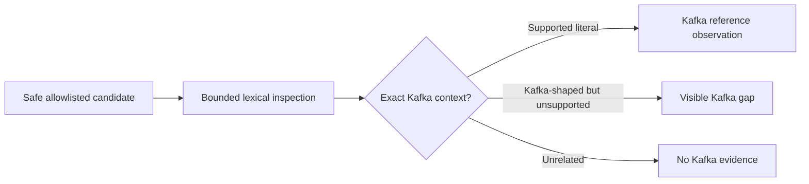

# Slice 7 Kafka Literal Inventory Contract

## Purpose

Slice 7 records a deliberately narrow inventory of literal Kafka topic and schema-subject
references in safe, versioned Java, Kotlin, and Java-properties files. It reports static
source evidence only. It does not claim that code runs, a broker topic or registry subject
exists, two repositories communicate, or any reference is used at runtime.



## Candidate boundary

Detector `kafka-literals`, version `1`, considers only:

- safe regular files ending in `.java` or `.kt`; and
- safe regular files whose case-sensitive basename is `application.properties` or matches
  `application-<profile>.properties`, where `<profile>` contains only ASCII letters,
  digits, dots, underscores, or hyphens.

Existing path, directory, symlink, sensitive-name, size, readability, and UTF-8 exclusions
apply before interpretation. The detector reads at most the existing 2 MiB file limit,
never follows symlinks, and normalizes CRLF and CR to LF for source-line accounting.

A Java or Kotlin file must contain at least one of these exact raw lexical markers before
tokenization: `NewTopic`, `KafkaTemplate`, `KafkaListener`, or
`SchemaRegistryClient`. A properties file must contain the exact raw key
`spring.kafka.template.default-topic`. These markers are only prefilters; they do not
authorize an observation.

The detector does not inspect arbitrary JSON, YAML, XML, Markdown, build scripts, text
files, or properties files. Existing AsyncAPI channel values remain API evidence and are
not reclassified as Kafka evidence.

## Observation vocabulary

Every observation has a safe repository-relative path and an exact, non-descending line
or line range. `schemas/kafka-observation.schema.json` defines the portable shape; the
dependency-free operational validator additionally enforces kind/value pairing and the
rules below.

| Kind | Required value fields | Allowed values |
| --- | --- | --- |
| `kafka-topic-reference` | `role`, `form`, `topic` | Roles and forms in the topic table below |
| `kafka-schema-reference` | `role`, `form`, `subject` | `schema-lookup`, `schema-registry-subject-lookup` |
| `kafka-gap` | `context`, `form`, `code`, `detail` | Context and form enums below; kebab-case code |

Supported topic roles and forms are paired exactly:

| Role | Form | Static meaning |
| --- | --- | --- |
| `declaration` | `new-topic` | A supported source construct instantiates a Kafka `NewTopic` with a literal name |
| `producer-send` | `kafka-template-send` | A supported `KafkaTemplate` receiver is called with a literal first topic argument |
| `producer-default` | `default-topic-property` | A supported Spring Kafka properties key has a literal default-topic value |
| `consumer-registration` | `kafka-listener` | A supported `KafkaListener` annotation contains exactly one literal topic |

Gap contexts are `topic-declaration`, `producer-send`, `consumer-registration`,
`schema-reference`, and `configuration`. Gap forms are `new-topic`,
`kafka-template-send`, `kafka-listener`, `schema-registry-subject-lookup`,
`default-topic-property`, and `kafka-source`.

## Literal model

Version 1 accepts only a non-empty, ordinary, double-quoted Java or Kotlin string token
whose value contains no escape, control character, Kotlin interpolation, Spring
placeholder, or SpEL expression. It accepts only a non-empty single-line properties
value containing no leading or trailing whitespace, backslash escape, continuation,
placeholder, or interpolation marker. Literal bytes are preserved; no escape decoding,
property resolution, expression evaluation, or normalization is performed.

Java text blocks, Kotlin raw strings, character literals, concatenations, identifiers,
method results, constants, arrays beyond the one supported listener element, and spread
arguments are not literals under this contract.

## Supported Java and Kotlin forms

The lexical pass ignores comments, ordinary string contents outside a matched construct,
character literals, Java text blocks, and Kotlin raw strings. Simple-name forms require
the exact import named below. Wildcard, static, and Kotlin aliased imports are not
accepted. Version 1 does not accept fully qualified inline forms, type aliases, inferred
receiver types, helper wrappers, or receiver bindings outside the same file.

### Topic declaration

The file must import exactly:

```text
org.apache.kafka.clients.admin.NewTopic
```

The supported single-physical-line forms are:

```text
new NewTopic("literal-topic", ...)
NewTopic("literal-topic", ...)
```

The first form covers Java and the second covers Kotlin. The constructor must contain at
least one argument after the literal topic name. The complete constructor call line is
the evidence range. This is a static declaration-shaped source reference; it does not
assert that Spring or Kafka creates the topic.

### Producer send

The file must import exactly:

```text
org.springframework.kafka.core.KafkaTemplate
```

The receiver identifier must have exactly one same-file binding in a supported shape:

```text
KafkaTemplate<...> receiver
val receiver: KafkaTemplate<...>
var receiver: KafkaTemplate<...>
receiver: KafkaTemplate<...>
```

The supported call is a single physical line:

```text
receiver.send("literal-topic", ...)
```

The call must contain at least one argument after the literal topic. Duplicate supported
bindings for the receiver make the binding ambiguous and produce a gap. Version 1 does
not attempt scope or overload resolution.

### Consumer registration

The file must import exactly:

```text
org.springframework.kafka.annotation.KafkaListener
```

The supported single-physical-line annotations are:

```text
@KafkaListener(topics = "literal-topic")
@KafkaListener(topics = ["literal-topic"])
```

The first form covers Java and the second covers Kotlin. No other annotation attribute is
supported in version 1. Multiple topics, arrays with more than one literal, positional
arguments, `topicPattern`, `topicPartitions`, spread values, placeholders, and expressions
produce gaps rather than topic references.

### Schema Registry subject lookup

The file must import exactly:

```text
io.confluent.kafka.schemaregistry.client.SchemaRegistryClient
```

The receiver identifier must have exactly one same-file Java or Kotlin binding using the
same shapes defined for `KafkaTemplate`. The only supported schema reference is:

```text
receiver.getLatestSchemaMetadata("literal-subject")
```

The complete call line is the evidence range. The observation records only the literal
Schema Registry subject string. It does not claim that the subject exists, is registered,
is compatible, contains a particular schema, or belongs to a topic. Registry URLs,
serializer classes, Java or Kotlin payload types, generated Avro or Protobuf classes, and
schema IDs are not schema references in version 1.

## Supported properties form

The only supported properties entry is one physical line with the exact spelling:

```text
spring.kafka.template.default-topic=literal-topic
```

Leading whitespace, alternate separators, continuations, escapes, empty values, duplicate
keys, placeholders, and interpolation are unsupported. A leading `#` or `!` comment is
ignored. The complete key/value line is the evidence range. This form is a producer
default reference; it is not a broker topic declaration.

## Gap behavior

Gaps are emitted only when an exact Kafka import, supported receiver binding, supported
annotation name, supported constructor name, or supported properties key establishes
Kafka-specific context. Unrelated source remains silent.

| Code | Meaning |
| --- | --- |
| `dynamic-topic` | A topic argument is a non-literal expression or function result |
| `interpolated-topic` | A topic string contains Kotlin interpolation or another interpolation marker |
| `property-derived-topic` | A topic uses a Spring placeholder, constant, or property indirection |
| `spread-topic` | A consumer topic value uses a Kotlin spread argument |
| `unsupported-multi-topic` | A listener supplies more than one topic |
| `ambiguous-kafka-binding` | A supported receiver identifier has duplicate bindings |
| `unsupported-kafka-import` | A Kafka marker uses a wildcard, static, or aliased import |
| `unsupported-producer-form` | A qualified producer construct is outside the producer allowlist |
| `unsupported-consumer-form` | A qualified listener construct is outside the consumer allowlist |
| `unsupported-topic-declaration` | A qualified `NewTopic` construct is outside the declaration allowlist |
| `dynamic-schema-subject` | A supported subject lookup uses a non-literal argument |
| `interpolated-schema-subject` | A subject string contains interpolation |
| `unsupported-schema-reference` | A qualified Schema Registry construct is outside the schema allowlist |
| `malformed-kafka-construct` | A recognized supported construct is unterminated or structurally incomplete |
| `unsupported-source-literal` | A Kafka-shaped construct uses a Java text block or Kotlin raw string |
| `unsupported-unicode-escape` | A Java Kafka candidate contains pre-lexical Unicode escape syntax |
| `duplicate-config-key` | The supported properties key occurs more than once |
| `unsupported-config-syntax` | The supported properties key uses an unsupported separator, continuation, or escape |
| `unsupported-property-value` | The supported properties key has an empty, whitespace-padded, placeholder, or interpolated value |
| `unsupported-literal-value` | A source literal contains an unsupported control character |

Gap details are fixed detector-owned text, never parser exceptions or source values. A
gap points to the affected marker line. Independent supported constructs in the same file
continue to produce observations.

## False-positive boundary

- An arbitrary string, topic-like method, class name, filename, or property is ignored.
- A method named `send` is ignored unless its receiver has an unambiguous supported
  `KafkaTemplate` binding under the exact import.
- An annotation named `KafkaListener` is ignored without the exact import.
- A local class named `NewTopic`, `KafkaTemplate`, or `SchemaRegistryClient` is ignored
  without the exact import and supported shape.
- Kafka-looking text in comments, ordinary strings, text blocks, raw strings, JSON, YAML,
  Markdown, AsyncAPI documents, or unrelated properties is ignored.
- Kafka Streams, `ProducerRecord`, `sendDefault`, custom wrappers, custom annotations,
  custom configuration keys, and other clients remain outside the positive allowlist.

## Determinism and evidence rules

- Source line ranges participate in the existing SHA-256 observation identity.
- Changing a literal, role, form, source path, or source range changes the identity.
- Repeated discovery at one full Git commit produces byte-for-byte identical JSON.
- Inventory observations remain sorted by ID and exclusions by path and reason.
- Identical references with the same kind, value, path, and line collapse to one
  observation because the persisted identity has no column component.
- Non-gap Kafka observations enter bounded evidence selection by their exact ranges.
- `kafka-gap` observations enter evidence-bundle `gaps` and never selected source text.
- Safety-filtered, oversized, non-UTF-8, unreadable, or symlinked candidates remain
  exclusions or are skipped through the existing safety rules.

## Semantic boundary and known gaps

All observations are syntactic and static. They do not establish runtime execution,
delivery guarantees, topic existence, registry state, schema compatibility, ownership,
business meaning, topology, or a relationship between repositories. Absence of a
supported reference means only that version 1 did not observe one within its declared
scope. Later reconciliation may say `unreferenced-in-scope` only while naming that scope
and its gaps; it must never say `unused`.

Version 1 deliberately does not implement full Java, Kotlin, Java-properties, or YAML
parsing; control/data-flow analysis; constant propagation; import or overload resolution;
schema resolution; network access; source execution; Kafka client access; catalog
promotion; or Conductor orchestration.

## Acceptance gate

- Portable schema fixtures and the dependency-free operational validator agree on valid
  and invalid Kafka observations.
- Synthetic Java and Kotlin repositories cover each positive form and retain unrelated
  Kafka-looking negative controls.
- Dynamic, interpolated, property-derived, spread, multi-topic, malformed, ambiguous, and
  unsupported forms produce stable gaps without guessed values.
- Safety exclusions, exact line ranges, stable IDs, repeated-discovery equality, and
  evidence selection are fixture-tested.
- The complete deterministic suite passes and an independent read-only review has no
  unresolved correctness or safety finding.
