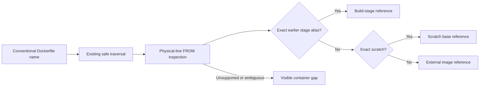

# Slice 8 Container Image Literal Inventory Contract

## Purpose

Slice 8 records a deliberately narrow inventory of literal Dockerfile `FROM`
references. It distinguishes external image literals, the special `scratch` base, and
references to earlier named build stages. It reports static syntax only: it does not
claim that an image exists, can be pulled, is built, is secure, is deployed, or belongs
to an application.



## Candidate and safety boundary

Detector `container-images`, version `1`, considers only case-sensitive basenames:

- exact `Dockerfile`;
- `Dockerfile.<suffix>`; or
- `<prefix>.Dockerfile`.

`prefix` and `suffix` are non-empty and match
`[A-Za-z0-9][A-Za-z0-9_-]*`. Names such as `dockerfile`, `DOCKERFILE`,
`.Dockerfile`, `Dockerfile.`, `myDockerfile`, and `Dockerfile.bak.txt` are not
candidates. No arbitrary file is searched for Docker syntax or image-shaped strings.

The detector reuses the existing excluded-directory, sensitive-name, symlink, 2 MiB,
readability, and UTF-8 boundaries. CRLF and CR are normalized to LF for line counting.
It never runs Docker, BuildKit, Compose, Kubernetes, Helm, Kustomize, a generator,
plugin, hook, wrapper, or source-owned script, and never contacts a registry, cluster,
URL, or network service.

## Supported `FROM` grammar

Version 1 inspects physical lines in file order. Blank lines and full-line comments are
ignored. ASCII space and tab may surround tokens. `FROM` and `AS` are
case-insensitive, but image and alias values are preserved exactly.

The sole positive shape is:

```text
FROM <reference> [AS <alias>]
```

The declaration must fit on one physical line, contain no option, quotation,
continuation, inline comment, or trailing token, and use a non-empty literal reference.
An alias matches `[A-Za-z0-9][A-Za-z0-9_.-]*`.

An external image literal uses a conservative Docker-name shape: slash-separated
lowercase name components, an optional registry port, an optional tag, an optional
digest, or both tag and digest. The exact literal is preserved; registries, default
tags, case, and digests are not normalized or resolved. Exact `scratch` is supported as
a distinct syntactic role and is not described as an external pullable image.

## Stage classification

An exact, case-sensitive match to a supported alias declared earlier in the same file
is a build-stage reference. The detector never looks ahead. A forward reference that
also satisfies the image-literal grammar remains an external image reference.

Aliases from unsupported `FROM` declarations are remembered only to prevent a later
token from being guessed as an external image. Duplicate aliases produce a gap, and a
later reference to that alias is ambiguous. A case-insensitive but non-exact match to
an earlier alias also produces an ambiguity gap. Version 1 does not inspect
`COPY --from`.

## Observation vocabulary

Every observation has a safe repository-relative path and exact source line.
`schemas/container-observation.schema.json` defines the portable shape; the
dependency-free operational validator enforces the same kind/value pairings.

| Kind | Required value fields | Optional value fields |
| --- | --- | --- |
| `container-image-reference` | `role`, `form`, `image` | `stageAlias` |
| `container-stage-reference` | `role`, `form`, `stage` | `stageAlias` |
| `container-gap` | `context`, `form`, `code`, `detail` | None |

Allowed role/form pairs are:

| Kind | Role | Form |
| --- | --- | --- |
| External image | `base-image` | `dockerfile-from` |
| Exact `scratch` | `scratch-base` | `dockerfile-from` |
| Earlier stage | `build-stage-base` | `dockerfile-from-stage` |

All gaps use `context: dockerfile-from` and `form: dockerfile-from`. Gap details are
fixed detector-owned text and never include source literals or parser exceptions.

| Gap code | Meaning |
| --- | --- |
| `dynamic-image-reference` | The reference contains build-argument or shell-variable syntax |
| `templated-image-reference` | The reference contains template syntax outside the literal contract |
| `unsupported-from-option` | A `FROM` option such as `--platform` is present |
| `unsupported-from-continuation` | A continued logical instruction contains or could create a `FROM` |
| `unsupported-escape-directive` | An escape parser directive changes continuation semantics |
| `unsupported-heredoc` | Heredoc syntax makes physical-line instruction recognition unsafe |
| `malformed-from` | The recognized instruction has missing, extra, quoted, or malformed tokens |
| `invalid-image-reference` | A non-dynamic reference is outside the conservative literal grammar |
| `invalid-stage-alias` | An `AS` alias is outside the supported alias grammar |
| `duplicate-stage-alias` | A stage alias was already declared earlier in the file |
| `ambiguous-stage-reference` | A later token cannot be classified uniquely against earlier aliases |
| `unsupported-stage-source` | A later token names an alias declared by an unsupported `FROM` |

An escape directive in the leading parser-directive region, or a quoted or unquoted
heredoc marker, produces one gap at its first occurrence and suppresses positive
extraction for that file. An ordinary comment later in the file does not become a parser
directive. Default backslash continuation state is tracked across non-comment
instructions so continuation text cannot become a false `FROM`.
Independent supported physical lines continue after a bounded continuation chain.

## False-positive boundary

- `FROM` must be the first instruction token and have a token boundary; `FROMAGE`,
  `RUN echo FROM`, strings, and full-line comments are silent.
- Inline comments are not stripped. `FROM alpine # comment` is malformed rather than a
  positive `alpine` reference.
- Image-looking values in YAML, JSON, properties, Markdown, Compose, Kubernetes, Helm,
  and Kustomize files are outside the candidate boundary.
- Variables, interpolation, templates, quotes, options, continuations, and malformed
  lines never become guessed image references.
- Safety-filtered, oversized, non-UTF-8, unreadable, and symlinked candidates remain
  excluded or skipped through the existing safety rules.

## Determinism and evidence

- The observation identity includes kind, value, path, and source line. Changing an
  image, stage, alias, role, form, path, or line changes the identity.
- Repeated discovery at one full commit produces byte-for-byte identical JSON.
- Non-gap observations enter bounded evidence selection at their exact lines.
- `container-gap` observations enter evidence-bundle gaps and never selected text.
- Observations remain sorted by ID and exclusions by path and reason.

## Explicit deferrals

Version 1 defers arbitrary Dockerfile names, full Dockerfile parsing, parser-directive
semantics, `--platform`, build-argument resolution, continuations, heredocs,
`COPY --from`, Compose, Kubernetes JSON and YAML, multi-document YAML, init and
ephemeral containers, Jobs and CronJobs, Helm, Kustomize, registry resolution,
pullability, provenance, SBOMs, signatures, vulnerability data, runtime state,
ownership, and cross-repository reconciliation.

Deployment-file positives are deferred because a complete conventional candidate and
structural boundary was not proven for this slice. In particular, adding a partial YAML
parser or only a subset of Kubernetes Pod-template locations would create misleading
coverage.

## Acceptance gate

- Portable Draft 2020-12 schema validation and the operational validator agree for all
  representative valid and invalid fixtures.
- Synthetic fixtures cover positives, negatives, gaps, stage ordering, safety,
  identity, deterministic output, evidence routing, and CLI integration.
- Heredoc bodies and continuation text cannot create `FROM` positives.
- All existing deterministic tests remain green.
- Independent read-only review reports no unresolved correctness or safety issue.
