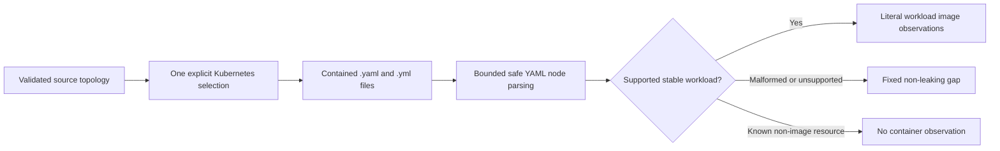

# Slice 9 Kubernetes YAML Image Inventory Contract

## Purpose

Slice 9 records literal container image declarations from one explicitly selected,
reviewed Kubernetes source selection. It supports plain Kubernetes YAML only. It does
not render templates, resolve overlays, contact a cluster or registry, or claim that a
workload is applied, scheduled, running, secure, or owned by an application.



## Approved decision

The user explicitly approved this Kubernetes YAML direction after read-only comparison
with Kubernetes JSON, Docker Compose, and deferral. Docker Compose remains deferred
because the application landscape does not use it. Kubernetes JSON remains deferred
because the approved real-landscape serialization is YAML.

The approved landscape convention is represented by an exact reviewed
`sourceSelections` entry rather than recomputed from folder names. A typical selection
points inside the `k8s-manifests` repository at a path shaped like
`k8s-capside/pro/mango/<domain>/<application-id>`, but the detector consumes only the
stored `repositoryId`, `subpath`, `kind`, and selection `id`. It never infers the domain,
application, deployable, or ownership from path segments.

## Command and scope boundary

The existing discovery command gains two optional arguments that must occur together:

```text
./tools/landscape discover SOURCE --repository ID \
  --topology SOURCE_TOPOLOGY --selection SOURCE_SELECTION_ID
```

Without these arguments, existing discovery behavior is unchanged and the Kubernetes
detector is not registered. With them, discovery:

1. parses and operationally validates the topology artifact;
2. resolves exactly one source selection by ID;
3. requires the selection `repositoryId` to equal `--repository`;
4. requires both the selection and topology repository kind to be `kubernetes`;
5. requires the selected subpath to exist as a contained directory without a symlink in
   any path component; and
6. runs only the repository-level Git detector and the Kubernetes detector configured
   for that selection. Other file, manifest, API, Kafka, and Dockerfile detectors do not
   sweep the rest of the infrastructure monorepo during a selection-scoped run.

The inventory persists the complete selected `id`, `repositoryId`, `subpath`, and `kind`
under `sourceSelection`. The evidence bundle preserves the same object. This records the
analyzed boundary even when no workload image is found and makes the bundle kind
`kubernetes` without inferring it from observations.

## Candidate and safety boundary

Inside the exact selected directory, detector `kubernetes-images`, version `1`,
recursively considers case-insensitive `.yaml` and `.yml` suffixes on safe regular files.
It never reads outside the selection, follows a symlink, or searches the rest of the
repository for Kubernetes-shaped content. Existing excluded-directory, sensitive-name,
2 MiB file-size, readability, and UTF-8 rules apply before parsing.

Recognized secret or non-workload resources never contribute selected source text.
Detector outputs contain only contracted image literals and fixed detector-owned gap
details. They never contain arbitrary YAML values, parser exception text, or secret data.

## YAML parser boundary

Slice 9 pins `PyYAML==6.0.2` and uses its safe node/event APIs. It never invokes a YAML
constructor capable of creating source-defined Python objects. Single- and
multi-document files are supported.

The following conditions are file-fatal: malformed YAML, duplicate mapping keys,
non-scalar mapping keys, explicit custom tags, anchors, aliases, merge keys, parser
resource exhaustion, or a deterministic limit violation. A file-fatal condition emits
one fixed gap and no positive observation from that file.

| Bound | Version 1 limit |
| --- | ---: |
| File size | 2 MiB |
| YAML documents per file | 64 |
| YAML node depth | 64 |
| YAML nodes per file | 50,000 |
| Kubernetes resources per file | 1,024 |
| Container entries per file | 4,096 |
| Nested generic Lists | 8 |

The event pass rejects anchors and aliases before semantic extraction. The node pass
checks tags, duplicates, merge keys, depth, and node count. Parser exceptions are mapped
to fixed details and never persisted.

## Supported workload matrix

Only these exact stable API-version and kind pairs are positive workload candidates:

| `apiVersion` | `kind` | PodSpec path |
| --- | --- | --- |
| `v1` | `Pod` | `spec` |
| `apps/v1` | `Deployment` | `spec.template.spec` |
| `apps/v1` | `StatefulSet` | `spec.template.spec` |
| `apps/v1` | `DaemonSet` | `spec.template.spec` |
| `apps/v1` | `ReplicaSet` | `spec.template.spec` |
| `batch/v1` | `Job` | `spec.template.spec` |
| `batch/v1` | `CronJob` | `spec.jobTemplate.spec.template.spec` |

Generic `v1/List` documents recursively validate every `items` entry from its own exact
`apiVersion` and `kind`. The corresponding `PodList`, `DeploymentList`,
`StatefulSetList`, `DaemonSetList`, `ReplicaSetList`, `JobList`, and `CronJobList`
wrappers are supported at the same API versions. A typed-list item may omit type
metadata; if present, it must agree with the wrapper.

Every PodSpec inspects `containers`, `initContainers`, and `ephemeralContainers`
independently. `containers` is required and must be a non-empty sequence. Optional
container arrays are inspected when present. Each entry must be an object with a
non-empty literal string `image` satisfying the existing conservative container-image
grammar.

Known non-image resources `HorizontalPodAutoscaler`, `NetworkPolicy`,
`PodDisruptionBudget`, `Service`, `ServiceAccount`, and KEDA `ScaledObject` remain
silent. Other kinds never receive guessed PodSpec paths. Unknown or custom resource
kinds produce a fixed unsupported-kind gap.

## Observation vocabulary

Kubernetes positives reuse `container-image-reference` with this exact value shape:

| Field | Contract |
| --- | --- |
| `role` | `workload-image` |
| `form` | `kubernetes-yaml` |
| `image` | Exact supported literal |
| `sourceSelectionId` | Explicit reviewed selection ID |
| `apiVersion` | Exact supported API version |
| `workloadKind` | Exact supported workload kind |
| `containerCategory` | `containers`, `initContainers`, or `ephemeralContainers` |
| `documentIndex` | Zero-based YAML document index |
| `pointer` | Stable escaped structural pointer containing field names and array indexes |

The pointer and document index distinguish repeated identical images on one physical
line. The source line points to the image scalar token, not merely its mapping key.

Kubernetes gaps reuse `container-gap` with `context: kubernetes-workload` and
`form: kubernetes-yaml`. Each gap also records `sourceSelectionId`, `documentIndex`, and
a structural `pointer`. Codes belong to a frozen enum and details are fixed strings.
The exact codes are `malformed-kubernetes-yaml`, `duplicate-kubernetes-key`,
`unsupported-kubernetes-key`, `unsupported-kubernetes-tag`,
`unsupported-kubernetes-anchor`, `unsupported-kubernetes-alias`,
`unsupported-kubernetes-merge`, `kubernetes-parser-resource-limit`,
`invalid-kubernetes-document`, `missing-kubernetes-type`,
`unsupported-kubernetes-version`, `unsupported-kubernetes-kind`,
`invalid-kubernetes-list`, `invalid-kubernetes-list-item`,
`invalid-kubernetes-workload`, `invalid-kubernetes-pod-spec`,
`missing-kubernetes-containers`, `invalid-kubernetes-container-array`,
`invalid-kubernetes-container`, `missing-kubernetes-image`,
`dynamic-kubernetes-image`, and `invalid-kubernetes-image`.

Malformed independent documents, List items, workloads, PodSpecs, container arrays, and
container entries produce local gaps while independent siblings continue. File-fatal
YAML failures are the only conditions that suppress every positive in a candidate file.

## Literal and semantic boundary

An image is positive only when it is a concrete non-empty YAML string without variable,
placeholder, or template syntax. The exact scalar is preserved. No registry, default
tag, digest, or case normalization occurs. Values containing `$`, `{{`, `}}`, ``, `<%`, or `%>` are dynamic gaps rather than positives.

Observations mean only that a supported checked-in workload declaration contains a
literal image reference at the recorded commit, selection, path, document, pointer, and
line. They do not establish build output, pullability, existence, execution, deployment,
health, security, provenance, ownership, or a relationship to another repository.

## Evidence and validation

- Kubernetes image observations select their exact image-scalar lines.
- Kubernetes gaps enter evidence-bundle gaps and never selected source text.
- The persisted selection is identical in the inventory and evidence bundle.
- Source paths remain repository-relative and must stay beneath the selected subpath.
- Existing file, range, line, and byte evidence limits remain in force. A large List may
  therefore be inventoried completely while later evidence selection visibly reports a
  selection limit.
- Portable Draft 2020-12 schema validation and the dependency-free operational validator
  must agree for all revised container and selection fixtures.
- Repeated discovery at one commit and selection must be byte-for-byte stable.

## Explicit deferrals

Slice 9 does not support Docker Compose; arbitrary Kubernetes JSON; beta workload APIs;
ReplicationController or PodTemplate; custom workload CRDs; KEDA `ScaledJob`; Helm;
Kustomize; overlays; patches; includes; remote references; templates; variable
substitution; generated manifests; registry or cluster access; or runtime interpretation.
Kubernetes Secrets and secret values remain outside evidence selection.

## Acceptance gate

1. Topology/selection arguments fail closed when missing, mismatched, unsafe, invalid, or
   outside the selected repository.
2. Every supported workload, List form, and container category has fixture coverage.
3. Known non-image resources remain silent and custom workload shapes are not guessed.
4. YAML duplicates, aliases, anchors, merges, tags, malformed input, and limits produce
   stable non-leaking gaps.
5. Exact scalar lines, document indexes, pointers, stable IDs, and evidence routing are
   tested, including repeated identical images on one line.
6. Portable schema parity, focused tests, the complete deterministic suite, and Git
   checks pass.
7. Independent read-only review has no unresolved correctness or safety finding.
