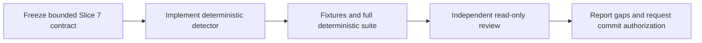

# Slice 7 Kafka Literal Inventory Handoff

## Purpose

Continue Bounded Knowledge with the next roadmap detector after the committed OpenAPI and
AsyncAPI inventory: a narrow, deterministic Kafka literal inventory. Use the same
contract-first, implementation, and independent-review pattern as Slice 6.

This handoff supersedes the implementation-status portions of the 2026-09-07 foundation
handoff. The foundation document remains useful for the architecture and safety model.



## Current state

- Repository: `/Users/cdespona/personal/bounded-knowledge`.
- Branch: `main`.
- Slice 6 OpenAPI and AsyncAPI inventory is committed at `ff70904`.
- The Slice 4 closure and this handoff belong to the commit after `ff70904`. Resolve its
  exact SHA with `git log`; do not assume `ff70904` contains them.
- Slice 4 authenticated Java and Kotlin Copilot trials are complete. Both raw responses
  were reduced through deterministic response extraction and both candidates passed
  evidence-bound validation.
- The Slice 4 closure adds `candidate extract`, hardens the cartographer output contract,
  documents host-authentication isolation, and includes CLI rejection tests for zero,
  multiple, and array-wrapped JSON responses.
- The deterministic suite passed 64 tests before this handoff was committed. Re-run it in
  the destination checkout rather than trusting this statement alone.
- OpenAPI/AsyncAPI is already implemented. Do not start it again.
- Conductor, canonical promotion, the local website, and the private pilot remain outside
  this slice.

## User-owned and local state

`sources.json` is user-owned local configuration and currently contains a private
repository path. It was deliberately excluded from the Slice 4 commit. Do not stage,
overwrite, revert, print, or include it in a handoff or patch without explicit user
permission.

After the authorized push that carries this handoff, the expected local status is only
` M sources.json`. Treat any additional dirty path as pre-existing or user-owned until it
has been inspected and attributed; do not absorb it into Slice 7 automatically.

Ignored `work/` contains disposable trial artifacts and may also contain evidence derived
from private repositories. Do not force-add, publish, summarize, or use those artifacts for
Slice 7. Build Slice 7 only from versioned synthetic fixtures.

Before editing, run:

```text
git status --short --branch
git log -3 --oneline --decorate
```

Preserve all pre-existing user changes. Do not use destructive Git commands.

## Required reading

Read these before defining the contract:

1. `AGENTS.md`
2. `README.md`
3. `docs/initiative/landscape-plan.md`, especially the evidence model, static contract-usage wording, roadmap, and immediate decision
4. `docs/contracts/slice-1.md`
5. `docs/contracts/slice-3.md`
6. `docs/contracts/slice-6-api-inventory.md`
7. `schemas/observation.schema.json`
8. `schemas/api-observation.schema.json`
9. `tools/detectors/__init__.py`
10. `tools/detectors/api_contract.py`
11. `tools/detectors/generic_files.py`
12. `tools/detectors/manifest_files.py`
13. `tools/landscape_core/discovery.py`
14. `tools/landscape_core/observations.py`
15. `tools/landscape_core/validation.py`
16. `tools/landscape_core/contracts.py`
17. `tools/landscape_core/evidence.py`
18. `tools/landscape_core/safety.py`
19. `examples/contracts/api-observations.valid.json` and `api-observations.invalid.json`
20. `tools/tests/test_api_contract.py`, `test_contracts.py`, `test_landscape.py`, and `test_cli.py`
21. Both synthetic Java and Kotlin fixtures

## Slice 7 objective

Define and implement the smallest useful deterministic inventory of literal Kafka evidence:

- topic declarations;
- producer sends;
- consumer registrations;
- explicit schema references;
- visible gaps for dynamic, interpolated, malformed, ambiguous, or unsupported forms.

Freeze an exact allowlist of supported Java, Kotlin, and configuration forms in
`docs/contracts/slice-7-kafka-inventory.md` before implementation. Do not classify an
arbitrary string, method named `send`, annotation, or property as Kafka evidence without a
contractually supported Kafka-specific context.

Suggested vocabulary may include `kafka-topic-reference`, `kafka-schema-reference`, and
`kafka-gap`, but the contract must justify the final names and exact fields before schemas
or implementation are written. Version 1 may deliberately support only one precisely
provable schema-reference form; every other recognized schema form must remain a visible
gap rather than being partially interpreted.

## Candidate-file boundary

The contract may authorize bounded scanning of safe, versioned `.java` and `.kt` source
files plus an explicit allowlist of configuration filenames or extensions. Existing size,
path, symlink, encoding, generated-output, vendor, and build-output exclusions apply before
content is read. A file must contain a contract-defined Kafka-specific lexical marker—such
as an exact Kafka import/type, annotation, or configuration-key family—before deeper
inspection. Do not search arbitrary repository-wide JSON, YAML, Markdown, or generic text
for topic-like strings. The contract must state the candidate markers and false-positive
boundary before implementation.

## Semantic boundary

Deterministic observations report only what a supported literal form declares or
references. They must not claim:

- that a producer or consumer runs;
- that a topic exists in a broker;
- that two repositories communicate;
- that a schema is registered or compatible;
- that an absent reference is unused;
- ownership, business meaning, delivery guarantees, or runtime topology.

Producer or consumer source evidence is static-only. Later reconciliation may use the
phrase `unreferenced-in-scope` with explicit analyzed scope and gaps; it must never convert
static absence into `unused`.

## Safety boundaries

- Python 3.9+ standard library only.
- Read source repositories only through the existing bounded traversal and safety filters.
- Never execute builds, wrappers, hooks, generators, plugins, application code, or source-owned scripts.
- Never contact Kafka, Schema Registry, URLs, or other network services.
- Never resolve local or remote schema references.
- Do not import or evaluate source-owned code or build configuration.
- Do not parse `.env`, secret values, Terraform state, kubeconfigs, keys, certificates,
  generated output, vendor trees, dependency caches, or build output.
- Unsupported constructs become stable gaps; do not guess or silently ignore them.
- Do not invoke Copilot or another model for repository analysis in this slice.
- Do not inspect private repositories or modify `sources.json`.
- Do not implement catalog promotion or Conductor workflows.

## Parallelization pattern

Use parallel agents only for isolated, non-overlapping work:

1. In parallel, perform read-only contract research, false-positive analysis, and fixture/test-matrix design.
2. Integrate and freeze one contract centrally before implementation.
3. After the contract is fixed, parallelize only files with explicit ownership, for example schema/fixtures versus detector-focused tests. Serialize shared-core edits and detector registration.
4. Run an independent read-only reviewer after integration. Resolve all correctness and safety findings before requesting commit authorization.

Agents share the same checkout, so never assign overlapping files concurrently.

## Acceptance gate

Slice 7 is complete only when:

1. Portable schema validation and the dependency-free operational validator agree for valid and invalid fixtures.
2. Supported literal declarations, producer sends, consumer registrations, and schema references have safe paths, exact line ranges, stable IDs, and explicit roles.
3. Dynamic, interpolated, property-derived, spread, malformed, and unsupported multi-topic forms produce stable gaps rather than guessed values.
4. Unrelated strings, methods, annotations, and configuration are not classified as Kafka evidence.
5. Oversized, non-UTF-8, excluded, unsafe, and symlinked content remains excluded or fails closed through existing safety rules.
6. Repeated discovery at one commit is byte-for-byte identical; changing a supported literal or its source range changes the observation identity.
7. Evidence selection carries Kafka observations and gaps without weakening bounds.
8. All existing tests remain green and focused Slice 7 fixture tests cover positive, negative, gap, safety, and determinism cases.
9. An independent read-only review finds no unresolved correctness or safety issue.
10. The final report lists changed files, tests, known gaps, exact dirty state, and whether commit/push authorization remains pending.

Run the full suite with:

```text
PYTHONDONTWRITEBYTECODE=1 python3 -m unittest discover -s tools/tests -v
```

Also run `git diff --check` and inspect `git status --short --branch` before handoff.

## Commit and push policy

Do not commit or push Slice 7 unless the user explicitly authorizes it. Never stage
`sources.json` or ignored `work/` artifacts. Use explicit path staging rather than
`git add .`.

## Stop conditions

Stop and ask for direction if useful Kafka evidence requires broad content search,
third-party parsing, source execution, network access, private repositories, or a semantic
claim beyond deterministic literal evidence. Report the unsupported need as a gap rather
than expanding scope automatically.
