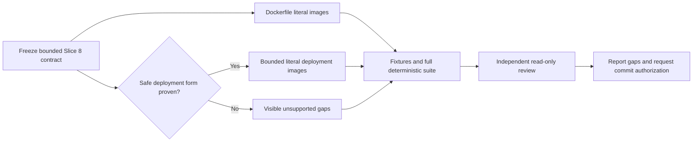

# Slice 8 Container Image Literal Inventory Handoff

## Purpose

Continue Bounded Knowledge after the committed Slice 7 Kafka literal inventory with the
next deliberately narrow roadmap increment: deterministic container-image evidence.
Begin with the smallest useful, safely provable Dockerfile boundary. Add deployment-file
support only where the contract can define a bounded candidate set and exact literal
semantics without executing source-owned tools or pretending to parse arbitrary YAML.



## Starting state

- Repository: `/Users/cdespona/personal/bounded-knowledge`.
- Branch: `main`.
- Slice 7 and this handoff are in the commit immediately after
  `d4beb56204da2ed2e1a721498879c2ad7e1471d5`. Resolve the exact pushed SHA with
  `git log -3 --oneline --decorate`; do not assume the parent SHA contains Slice 7.
- Slice 7 adds detector `kafka-literals`, version `1`, plus a strict portable schema,
  operational validator, fixtures, evidence routing, and focused tests.
- The final Slice 7 deterministic suite passed 81 tests.
- An offline Draft 2020-12 validator accepted all 6 valid Kafka fixtures and rejected all
  5 invalid Kafka fixtures. No runtime dependency was added.
- Independent review raised nine Kafka lexer, identity, false-positive, and configuration
  findings across three review passes. Every finding was resolved, regression-tested,
  and the final read-only verdict was clean.
- OpenAPI/AsyncAPI and Kafka are complete. Do not restart or broaden them in Slice 8.
- Conductor, canonical promotion, the private pilot, and the local website remain outside
  this slice.

## User-owned and local state

`sources.json` is user-owned local configuration and contains a private repository path.
It must remain outside Slice 8. Do not stage, overwrite, revert, print, summarize, or
include it in a patch without explicit user permission.

After the authorized Slice 7 push, the expected local status is only the preserved
working-tree modification to `sources.json`. Treat any additional dirty path as
pre-existing or user-owned until inspected and attributed.

Ignored `work/` may contain private-repository-derived evidence. Do not inspect, use,
summarize, publish, or force-add it. Do not inspect `graphify-out/` as a source of
canonical or implementation evidence. Build Slice 8 only from versioned synthetic
fixtures and repository contracts.

Before editing, verify the branch, pushed commit, and dirty state without printing
`sources.json` contents. Never use destructive Git commands.

## Required reading

Read these before defining the contract:

1. `AGENTS.md`
2. `README.md`
3. `docs/initiative/landscape-plan.md`, especially evidence semantics, roadmap, and the
   immediate next decision
4. `docs/contracts/slice-1.md`
5. `docs/contracts/slice-3.md`
6. `docs/contracts/slice-6-api-inventory.md`
7. `docs/contracts/slice-7-kafka-inventory.md`
8. `schemas/observation.schema.json`
9. `schemas/api-observation.schema.json`
10. `schemas/kafka-observation.schema.json`
11. `tools/detectors/__init__.py`
12. `tools/detectors/generic_files.py`
13. `tools/detectors/manifest_files.py`
14. `tools/detectors/api_contract.py`
15. `tools/detectors/kafka_literals.py`
16. `tools/landscape_core/discovery.py`
17. `tools/landscape_core/observations.py`
18. `tools/landscape_core/validation.py`
19. `tools/landscape_core/contracts.py`
20. `tools/landscape_core/evidence.py`
21. `tools/landscape_core/safety.py`
22. API and Kafka valid/invalid contract fixtures
23. `tools/tests/test_api_contract.py`, `test_kafka_inventory.py`, `test_contracts.py`,
    `test_landscape.py`, and `test_cli.py`
24. Both synthetic Java and Kotlin fixtures

## Slice 8 objective

Define and implement the smallest useful deterministic inventory of literal container
image evidence. The minimum viable positive capability is a Dockerfile `FROM` literal.
The contract must decide, before implementation, whether any deployment serialization
can be supported safely in the same slice.

Potential vocabulary may include `container-image-reference` and `container-gap`, but
the contract must justify the final kind names, roles, forms, and exact fields before
schemas or implementation are written.

At minimum, distinguish syntactic roles instead of implying runtime deployment:

- base image declarations;
- named build-stage references versus external image references;
- deployment-template image references, only if a bounded structural form is supported;
- visible dynamic, interpolated, malformed, ambiguous, or unsupported constructs.

Do not claim that an image exists, is pullable, is running, is deployed, is secure, is
owned by an application, or corresponds to another repository.

## Contract research questions

Resolve these centrally before implementation:

1. Which filenames are Dockerfile candidates? Consider exact `Dockerfile`,
   `Dockerfile.<suffix>`, and `*.Dockerfile`; avoid arbitrary text search.
2. Which `FROM` grammar subset is exact enough for version 1? Decide the handling of
   optional `--platform`, tags, digests, aliases, multiple stages, scratch, and comments.
3. How will stage aliases be distinguished from external images in later `FROM` or
   `COPY --from` forms without guessing?
4. Which variable forms produce gaps: `${ARG}`, `$ARG`, shell expansion, build arguments,
   templating, continuation lines, or escape directives?
5. Are Docker Compose files in scope? If so, only an exact serialization and candidate
   boundary may authorize parsing; otherwise record the deferral explicitly.
6. Can Kubernetes JSON be limited to conventional filenames and exact workload shapes
   using the standard library? If not, defer it.
7. Kubernetes, Helm, and Kustomize are normally YAML-heavy. Decide whether conventional
   filenames should create explicit unsupported-serialization gaps without reading YAML
   contents, mirroring Slice 6, or remain outside this detector until a later slice.
8. How will init containers, ephemeral containers, CronJob job templates, and multiple
   documents be handled without partial or misleading coverage?
9. Which exact gap codes and fixed detector-owned details are required?
10. How will evidence selection carry container gaps without weakening existing bounds?

## Recommended version-1 boundary

The default recommendation is:

- positively support single-physical-line Dockerfile `FROM` declarations with literal
  external image names, optional literal tag or digest, and optional `AS` alias;
- preserve the literal reference exactly rather than normalizing registries, default
  tags, case, or digests;
- distinguish a later reference to a previously declared stage alias from an external
  image reference only when the alias match is exact and earlier in the same file;
- emit gaps for variable-derived, interpolated, continued, malformed, or unsupported
  `FROM` forms;
- leave `RUN`, `CMD`, `ENTRYPOINT`, registry access, build execution, and vulnerability
  analysis outside scope;
- treat Kubernetes/Helm/Kustomize YAML as a separate contract decision. Do not add a
  hand-written partial YAML parser merely to widen Slice 8;
- add bounded Kubernetes JSON only if contract research proves a narrow candidate and
  workload-shape boundary. Otherwise defer deployment-image positives to Slice 9.

This recommendation is intentionally revisable during the contract-research phase. The
final contract, not this handoff, governs implementation.

## Candidate-file and safety boundary

- Reuse the existing safe traversal, 2 MiB file limit, UTF-8 handling, excluded
  directories, sensitive-name rules, and symlink rejection.
- Candidate filenames must be fixed before content inspection.
- A cheap raw marker may prefilter candidates, but it cannot authorize an observation.
- Do not search arbitrary repository-wide YAML, JSON, Markdown, properties, shell, or
  generic text for image-like strings.
- Do not execute Docker, BuildKit, Compose, Kubernetes, Helm, Kustomize, generators,
  plugins, hooks, wrappers, or source-owned scripts.
- Do not contact registries, clusters, URLs, or network services.
- Do not resolve manifests, bases, overlays, charts, templates, variables, or remote
  references.
- Unsupported constructs become stable observations or explicit documented deferrals;
  never guess or silently reinterpret them.

## Semantic boundary

Deterministic observations report only what a supported literal construct declares or
references. They must not claim:

- that an image exists, is current, is secure, or can be pulled;
- that a Dockerfile is built;
- that a workload is applied, scheduled, running, or healthy;
- that a container image belongs to an application or repository;
- that identical image strings establish a cross-repository relationship;
- ownership, business meaning, runtime topology, deployment frequency, or provenance.

Later reconciliation may use static-only language with explicit scope and gaps. Static
absence must never become `unused` or `not deployed`.

## Implementation sequence

Use the same sequence that closed Slice 7:

1. In parallel, perform isolated read-only contract research, false-positive analysis,
   and fixture/test-matrix design.
2. Integrate and freeze one contract centrally before implementation.
3. After the contract is fixed, parallelize only non-overlapping files with explicit
   ownership, such as schema/fixtures versus focused tests.
4. Serialize detector implementation, shared validator/evidence changes, registration,
   and documentation updates.
5. Run the complete deterministic suite and portable-schema parity checks.
6. Run an independent read-only review after integration.
7. Resolve every correctness and safety finding, add regressions, and repeat review until
   the verdict is clean.

## Acceptance gate

Slice 8 is complete only when:

1. Portable schema validation and the dependency-free operational validator agree for
   representative valid and invalid fixtures.
2. Every supported image reference has a safe path, exact line range, explicit syntactic
   role and form, and stable identity.
3. Variables, interpolation, stage aliases, platform flags, continuations, comments,
   malformed constructs, and unsupported serializations behave exactly as contracted.
4. Unrelated strings, image-like values, filenames, YAML, JSON, and custom configuration
   are not classified without the required context.
5. Oversized, non-UTF-8, excluded, unsafe, unreadable, and symlinked content remains
   excluded or fails closed through existing safety rules.
6. Repeated discovery at one commit is byte-for-byte identical; changing a supported
   literal or source range changes observation identity.
7. Evidence selection carries supported observations and gaps without weakening bounds.
8. Focused fixtures cover positive, negative, gap, safety, ordering, identity,
   determinism, evidence, and CLI integration behavior.
9. All existing tests remain green.
10. Independent read-only review has no unresolved correctness or safety issue.
11. Final reporting lists changed files, validation, known gaps, review findings, exact
    dirty state, and pending commit/push authorization.

Run the complete suite with:

```text
PYTHONDONTWRITEBYTECODE=1 python3 -m unittest discover -s tools/tests -v
```

Also run `git diff --check` and inspect branch/status without exposing `sources.json`
contents before handoff.

## Commit and push policy

Do not commit or push Slice 8 unless the user explicitly authorizes it. Never stage
`sources.json`, ignored `work/`, graph artifacts, or private evidence. Use explicit path
staging rather than `git add .`.

## Stop conditions

Stop and request direction if useful image evidence requires broad content search,
third-party parsing, source execution, build tooling, network access, private
repositories, or semantic claims beyond deterministic literal evidence. Record the
unsupported need as a gap or documented deferral rather than expanding scope silently.
