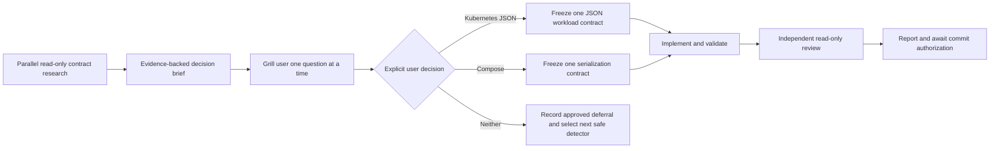

# Slice 9 Deployment Image Boundary Handoff

## Purpose

Continue Bounded Knowledge after the completed Slice 8 Dockerfile `FROM` literal
inventory. Slice 9 begins with contract research, not an assumption that deployment-file
support is safe. Its first decision is whether one deployment serialization has both a
bounded candidate-file rule and complete structural coverage that can be implemented
without YAML guesswork, source execution, network access, or misleading partial results.



## Starting state

- Repository: `/Users/cdespona/personal/bounded-knowledge`.
- Branch: `main`.
- The pushed commit containing Slice 8 and this handoff is the commit after
  `d67264167166ab5e0746f166ae2d09d2c445f2b6`. Resolve and report its exact SHA before
  editing; do not assume the parent contains Slice 8.
- Slice 8 detector: `container-images`, version `1`.
- Slice 8 supports case-sensitive `Dockerfile`, `Dockerfile.<suffix>`, and
  `<prefix>.Dockerfile` candidates with bounded single-physical-line `FROM` forms.
- It distinguishes external image literals, `scratch`, and exact references to earlier
  named build stages.
- Container gaps flow into evidence-bundle gaps; supported references select exact source
  lines.
- The final complete deterministic suite passed 93 tests.
- Portable Draft 2020-12 validation accepted all 4 valid container fixtures and rejected
  all 10 invalid fixtures.
- Independent review required four passes. Six correctness and parity findings were
  fixed and regression-tested; the final verdict was clean.

## User-owned and local state

`sources.json` is user-owned local configuration and contains a private repository path.
It was deliberately excluded from the Slice 8 commit. Do not stage, overwrite, revert,
print, summarize, or include it in a patch without explicit user permission.

After the authorized Slice 8 push, the expected local status is only:

```text
 M sources.json
```

Treat any additional dirty path as pre-existing or user-owned until inspected and
attributed. Never use destructive Git commands.

Ignored `work/` may contain private-repository-derived evidence. Do not inspect, use,
summarize, publish, or force-add it. Do not inspect `graphify-out/` as canonical or
implementation evidence. Do not inspect private repositories without explicit scope and
authorization.

Before editing, run:

```text
git status --short --branch
git log -3 --oneline --decorate
git rev-parse HEAD
git rev-parse origin/main
```

## Required reading

Read these before deciding Slice 9 scope:

1. `AGENTS.md`
2. `README.md`
3. `docs/initiative/landscape-plan.md`
4. `docs/initiative/deferred-capabilities.md`
5. `docs/contracts/slice-1.md`
6. `docs/contracts/slice-3.md`
7. `docs/contracts/slice-6-api-inventory.md`
8. `docs/contracts/slice-7-kafka-inventory.md`
9. `docs/contracts/slice-8-container-image-inventory.md`
10. `docs/handoffs/2026-09-18-slice-8-container-images-handoff.md`
11. `schemas/observation.schema.json`
12. `schemas/container-observation.schema.json`
13. `tools/detectors/container_images.py`
14. `tools/detectors/api_contract.py`
15. `tools/landscape_core/discovery.py`
16. `tools/landscape_core/contracts.py`
17. `tools/landscape_core/validation.py`
18. `tools/landscape_core/evidence.py`
19. `tools/landscape_core/safety.py`
20. `tools/tests/test_container_inventory.py`
21. Container valid/invalid contract fixtures and both synthetic service fixtures

## Slice 8 implementation history

Slice 8 followed contract-first, isolated implementation ownership, central integration,
and independent review:

1. Read-only agents researched the contract, adversarial false positives, and fixture
   matrix in parallel.
2. The central contract froze Dockerfile-only positive support. Deployment-file positives
   were deferred because a complete candidate and structural boundary was not proven.
3. Schema/contract fixtures and focused tests/synthetic Dockerfiles were implemented in
   non-overlapping ownership areas.
4. Detector registration, shared validation, evidence routing, documentation, and
   deferred-register changes were integrated centrally.
5. Independent review findings fixed quoted heredocs, parser state around comments,
   continuation chains across comments, persisted image grammar, and JSON Schema line
   terminator parity for images, aliases, and source lines.

Do not remove these regressions while widening the detector.

## Slice 9 contract-research objective

Answer one narrow question: can a deployment-image serialization be supported completely
enough to avoid misleading coverage?

Research these alternatives independently before selecting one:

### Kubernetes JSON

- Is there a fixed conventional candidate filename rule that does not scan arbitrary
  repository JSON?
- Can version 1 cover every selected workload kind and every relevant PodSpec path rather
  than only the easiest subset?
- If included, decide exact treatment of Pod, Deployment, StatefulSet, DaemonSet,
  ReplicaSet, Job, CronJob, List wrappers, `containers`, `initContainers`, and
  `ephemeralContainers`.
- Define duplicate-key rejection, JSON depth/resource limits, exact source-line mapping,
  API version/kind policy, malformed subtrees, and independent gap behavior.
- Do not claim that a workload is applied, scheduled, running, or owned by an application.

### Docker Compose

- Do not parse YAML without an explicit safe dependency/serialization decision.
- Do not treat arbitrary `compose*.json` or generic JSON as Compose based only on content.
- If one serialization is proposed, define exact conventional filenames, version policy,
  service structure, `image` versus `build`, dynamic values, extensions, includes, and
  profiles before implementation.

### YAML, Helm, and Kustomize

- Do not add a hand-written partial YAML parser.
- Do not execute Helm or Kustomize, resolve charts/bases/overlays, or fetch remote content.
- Filename-only gaps are allowed only if the filename itself establishes sufficiently
  precise context; otherwise keep the capability deferred in documentation rather than
  emitting noisy observations.

## Decision rule

Research may establish facts and recommend a direction, but it does not authorize either
implementation or final deferral. Freeze and implement at most one deployment
serialization in Slice 9, and proceed only after both conditions hold:

1. research proves all of the following gates; and
2. the user explicitly chooses Kubernetes JSON, Compose, or neither after the required
   grill.

| Gate | Required evidence |
| --- | --- |
| Candidate boundary | Fixed filenames or another deterministic rule that avoids arbitrary content search |
| Structural completeness | Every in-scope workload/service shape and image location is enumerated |
| Parser boundary | Standard-library parsing or an explicitly approved dependency; no source execution |
| Evidence location | Exact, reproducible source lines or a contracted fail-closed gap |
| Unsupported behavior | Stable fixed-code gaps without leaking source values |
| Semantic restraint | Static declaration/reference wording only |

If no candidate passes all gates, recommend deferral, but do not finalize that deferral or
select the next detector without explicit user approval. After approval, update the
deferred-capabilities register and recommend the next safe roadmap detector—normally a
separately contracted Terraform literal inventory—rather than widening Slice 9 silently.

## Research brief and mandatory grill

After read-only research, stop and present one concise comparison before changing any
schema, detector, test fixture, contract, or deferred status:

| Option | Candidate boundary | Structural coverage | Parser/evidence boundary | Gaps and risks | Recommendation |
| --- | --- | --- | --- | --- | --- |
| Kubernetes JSON | Proven or unproven | Exact workload and PodSpec forms | Exact parser and source-line policy | Missing or ambiguous forms | Implement or defer |
| Docker Compose | Proven or unproven | Exact service/image/build forms | Exact serialization and candidate policy | YAML, includes, profiles, extensions | Implement or defer |
| Neither | Not applicable | Not applicable | Not applicable | Why both fail the gates | Move to the next safe detector |

Then interview the user one question at a time. For every question:

- provide the recommended answer and its rationale;
- answer it from repository evidence instead of asking when research can establish the
  fact;
- ask only about a choice, priority, real-world convention, dependency appetite, or
  source context that the repository cannot establish safely;
- resolve dependent branches before moving to the next question.

Expected decision topics include whether the real landscape contains useful Kubernetes
JSON or Compose inputs, whether an authoritative candidate filename/location convention
exists, whether a third-party YAML dependency is acceptable, whether incomplete workload
coverage is acceptable, and whether Terraform should be next if neither deployment
format passes.

The agents must obtain an explicit user statement choosing one of these outcomes:

1. approve a specific bounded Kubernetes JSON contract direction;
2. approve a specific bounded Compose contract direction; or
3. approve deferral of both and the next roadmap direction.

Silence, lack of objection, an agent recommendation, or a research result is not
approval. Stop after the grill if the user has not made an explicit choice.

## Execution sequence

1. In parallel, run isolated read-only research for Kubernetes JSON, Compose
   serialization/candidates, and adversarial completeness/false-positive analysis.
2. Integrate the evidence-backed comparison centrally without changing implementation or
   deferred statuses.
3. Run the mandatory one-question-at-a-time grill and stop for explicit user approval.
4. Record the approved decision centrally.
5. If a boundary is approved, freeze one contract and then parallelize only explicitly
   non-overlapping schema/fixture and focused-test files.
6. Serialize detector implementation, shared validator/evidence changes, registration,
   and documentation updates.
7. Run portable schema parity, focused tests, the complete deterministic suite, and Git
   diff/status checks.
8. Run an independent read-only review after integration. Resolve every correctness and
   safety finding and repeat review until clean.

## Safety and semantic boundaries

- Python 3.9+ standard library only unless the contract explicitly approves a parser
  dependency; adding a dependency requires a separate reviewed decision.
- Do not execute source builds, wrappers, hooks, generators, plugins, Docker, BuildKit,
  Compose, Kubernetes, Helm, Kustomize, Terraform, or application scripts.
- Do not access registries, clusters, URLs, remote references, or network services.
- Do not inspect `.env`, Terraform state, kubeconfigs, private keys, certificates, secret
  values, generated code, vendor trees, dependency caches, or build output.
- Do not invoke Copilot or another external model for repository analysis.
- Do not infer runtime deployment, image existence, security, ownership, provenance,
  cross-repository relationships, or business meaning.
- Do not implement Conductor, canonical promotion, the private pilot, or the website.

## User testing checklist for Slice 8

Before widening the initiative, the user can test the completed detector against clean,
explicitly selected Git repositories:

1. Pull the pushed Slice 8 commit and run the complete deterministic suite.
2. Run `./tools/landscape discover` against a clean test repository containing supported
   Dockerfile names.
3. Confirm literal external images, `scratch`, and earlier exact stage aliases appear with
   exact paths and lines.
4. Confirm variables, `--platform`, continuations, heredocs, malformed forms, and
   ambiguous aliases produce gaps rather than guessed image values.
5. Confirm Compose, Kubernetes, YAML, JSON, Markdown, unrelated filenames, symlinks,
   excluded directories, and sensitive files do not become positive container evidence.
6. Run `validate` and `evidence select` on the resulting inventory; container gaps must
   appear only in evidence-bundle gaps, while supported references select exact lines.

Discovery requires the test repository to be an independent clean Git root at an explicit
commit. Do not point testing at private repositories until the user explicitly selects and
authorizes them.

## Validation commands

```text
PYTHONDONTWRITEBYTECODE=1 python3 -m unittest discover -s tools/tests -v
git diff --check
git status --short --branch
```

For a new persisted schema, also run an offline Draft 2020-12 validator against every
valid and invalid fixture and compare the result with the dependency-free operational
validator.

## Commit and push policy

Do not commit or push Slice 9 without explicit authorization. Never stage `sources.json`,
ignored `work/`, `graphify-out/`, or private evidence. Use explicit path staging rather
than `git add .`.

## Completion report

Report the exact starting SHA, research brief, grill questions and explicit user decision,
changed files, validation, known gaps, deferred-register changes, every
independent-review finding and resolution, exact dirty state, and whether commit/push
authorization remains pending.
