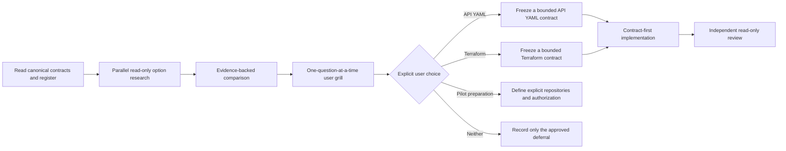

# Slice 10 Direction Selection Handoff

## Purpose

Continue Bounded Knowledge after the completed Slice 9 Kubernetes YAML workload-image
inventory. Slice 10 is not yet assigned to a detector or pilot. Its first deliverable is
an evidence-backed direction comparison and a one-question-at-a-time user discussion.
Repository research may recommend a direction, but it does not authorize a contract,
implementation, private-repository access, final deferral, or roadmap change.



## Starting state

- Repository: `/Users/cdespona/personal/bounded-knowledge`.
- Branch: `main`.
- Pushed Slice 9 commit: `c2a535378a42ba28e515777ee669e60ca8828b3c`.
- Commit subject: `Add bounded Kubernetes YAML image inventory`.
- At the time of this handoff, `HEAD`, `main`, and local `origin/main` all resolve to that
  SHA. The next agent must resolve and report the exact starting SHA again before editing.
- The deterministic suite passed 107 tests.
- All 13 portable Draft 2020-12 schemas were structurally valid.
- Container parity accepted 8 valid fixtures and rejected 18 invalid fixtures.
- Independent Slice 9 review ended clean after five findings were fixed and
  regression-tested.
- No next detector, pilot, Conductor work, promotion work, or website work is selected.

## User-owned and local state

`sources.json` remains user-owned local configuration and is modified but unstaged. It
was excluded from the Slice 9 commit. Do not stage, revert, overwrite, print, summarize,
or include it in a patch without explicit user permission.

After the Slice 9 push, the expected local status is only:

```text
 M sources.json
```

Treat any other dirty path as user-owned until it is attributed. Do not use destructive
Git commands. Do not inspect ignored `work/`, `graphify-out/`, private repositories, or
private evidence.

Before editing, resolve the checkout without exposing protected contents:

```text
git status --short --branch
git log -3 --oneline --decorate
git rev-parse HEAD
git rev-parse main
git rev-parse origin/main
```

## Required reading

Read these completely before researching the next direction:

1. `AGENTS.md`
2. `README.md`
3. `docs/initiative/landscape-plan.md`
4. `docs/initiative/deferred-capabilities.md`
5. `docs/contracts/slice-1.md`
6. `docs/contracts/slice-3.md`
7. `docs/contracts/slice-5a-source-topology.md`
8. `docs/contracts/slice-6-api-inventory.md`
9. `docs/contracts/slice-7-kafka-inventory.md`
10. `docs/contracts/slice-8-container-image-inventory.md`
11. `docs/contracts/slice-9-kubernetes-image-inventory.md`
12. `docs/handoffs/2026-09-21-slice-9-deployment-images-handoff.md`
13. `schemas/observation.schema.json`
14. `schemas/evidence-bundle.schema.json`
15. `tools/detectors/api_contract.py`
16. `tools/detectors/kubernetes_images.py`
17. `tools/landscape_core/discovery.py`
18. `tools/landscape_core/contracts.py`
19. `tools/landscape_core/validation.py`
20. `tools/landscape_core/evidence.py`
21. Relevant synthetic fixtures and focused tests for any option being compared

## Slice 9 implementation history

Slice 9 established several boundaries that later work must preserve:

- Deployment discovery is selection-scoped through one exact reviewed
  `sourceSelections` entry. The detector does not derive application ownership or domain
  meaning from path segments.
- Plain Kubernetes YAML uses pinned `PyYAML==6.0.2` safe event and node APIs, exact core
  tag allowlists, duplicate-key rejection, fixed resource limits, and fixed non-leaking
  gaps.
- Supported stable workload and List shapes are complete within the frozen matrix.
- Kubernetes inventories and evidence bundles must persist the exact source selection.
- Selected and excluded paths must remain below the selection subpath.
- Docker Compose, Kubernetes JSON, Helm, Kustomize, beta APIs, and custom workload CRDs
  remain deferred.
- Review regressions cover non-string typed-List metadata, crafted YAML tags, the exact
  silent non-image set, fixed code/detail pairs, and mandatory selection provenance.

Do not weaken or generalize these rules as a side effect of another detector.

## First objective: choose the next direction

Research the following options independently and compare them centrally. The shortlist
comes from the current roadmap and deferred register; its presence is not approval.

### Option A: OpenAPI and AsyncAPI YAML parity

Research whether the existing Slice 6 conventional filename boundary and operation
vocabulary can be extended to YAML without changing semantic scope.

At minimum determine:

- whether the existing JSON candidate filename allowlist maps exactly to YAML;
- whether the Slice 9 safe YAML event/node gate can be reused without coupling API and
  Kubernetes semantics;
- whether OpenAPI and AsyncAPI source locations can be mapped to exact physical lines;
- whether duplicate keys, tags, aliases, anchors, merges, malformed documents, multiple
  documents, and resource limits have complete fail-closed behavior;
- whether supported versions and operation vocabularies remain identical to Slice 6;
- whether `$ref`, schemas, components, payloads, remote resolution, and runtime usage stay
  deferred; and
- whether current filename-only YAML gaps migrate cleanly without changing historical
  JSON observations.

The existing PyYAML dependency makes parser research possible but does not authorize
implementation or automatic reuse of Kubernetes parsing code.

### Option B: Terraform literal inventory

Research whether one exact Terraform source selection can support a useful static
version-1 inventory without evaluating HCL or reading state.

At minimum determine:

- the exact source-topology and candidate-file boundary;
- whether `.tf` alone is sufficiently precise and how `.tf.json`, override files,
  generated files, `.terraform/`, lock files, plans, state, and variable-value files are
  treated;
- whether a safe pinned HCL parser is required and acceptable, or whether no complete
  non-executing parser boundary is currently available;
- the smallest structurally complete observation vocabulary, such as literal resource,
  data, module, provider, variable, output, and explicit reference forms;
- exact handling of expressions, interpolation, dynamic blocks, `for_each`, `count`,
  provider aliases, modules, locals, and unknown values;
- exact line and selection provenance, fixed resource limits, and non-leaking gaps; and
- how to avoid inferring deployment, ownership, cloud existence, access, cost, security,
  or cross-repository relationships.

Never execute Terraform, read state or plans, initialize modules, inspect caches, or
resolve local or remote module sources during research.

### Option C: private-pilot preparation

Research whether the current deterministic chain is sufficient to stop expanding
detectors and prepare the manual three-application pilot described in the roadmap.

At minimum determine:

- which acceptance criteria can already be exercised with Slices 1-9;
- which missing detector or contract would make the pilot materially misleading;
- the exact user decisions still required for application, Kubernetes, and any Terraform
  selections;
- what read-only repository access, Copilot customization review, evidence retention,
  model budget, and human-review boundaries must be authorized; and
- which work can be specified without accessing any private repository.

Research does not authorize opening a private repository, resolving `sources.json`,
running Copilot, or starting the pilot.

### Option D: neither or a user-proposed alternative

The comparison may recommend deferring all three options or researching another existing
deferred capability. Do not invent a fourth implementation direction. A user-proposed
alternative must receive the same contract, safety, provenance, value, and completeness
analysis before it can be selected.

## Comparison requirements

Before changing a contract, detector, schema, fixture, roadmap status, or deferred
status, present this decision table with evidence:

| Option | User value | Candidate boundary | Structural completeness | Parser/dependency boundary | Safety/provenance | Missing real-world context | Recommendation |
| --- | --- | --- | --- | --- | --- | --- | --- |
| API YAML parity | Proven or unknown | Proven or unproven | Exact supported matrix | Safe parser and line model | Exact gaps and exclusions | Questions only the user can answer | Implement, defer, or research further |
| Terraform inventory | Proven or unknown | Proven or unproven | Exact literal vocabulary | Safe HCL decision | No execution/state/network | Questions only the user can answer | Implement, defer, or research further |
| Pilot preparation | Proven or unknown | Exact repositories/selections required | Existing detector coverage | Model and evidence boundary | Private access and review gates | Explicit pilot choices | Prepare, defer, or fill one prerequisite |
| Neither/alternative | Reason for stopping or changing direction | Not applicable or newly researched | Not applicable or newly researched | Not applicable or newly researched | Remaining risk | Explicit user priority | Defer or propose research |

Use repository evidence to answer repository questions. Ask the user only for priorities,
real-world conventions, private-scope facts, dependency appetite, or authorization that
the repository cannot establish.

## Mandatory discussion and approval gate

After presenting the comparison, grill the user one question at a time. For each
question:

1. state the recommended answer and why;
2. distinguish repository evidence from assumptions or user-supplied context;
3. ask only one decision question;
4. resolve its consequences before asking the next question; and
5. record the explicit answer for the final report.

The discussion should resolve, as applicable:

- whether the next outcome should maximize near-term pilot value or detector breadth;
- whether API contracts are commonly YAML in the real landscape;
- whether Terraform repositories and reviewed topology selections exist;
- whether adding a pinned HCL dependency is acceptable;
- whether the current detector set is sufficient for a useful pilot;
- which three applications and infrastructure selections could form the pilot;
- whether any private-repository access is authorized and under what exact boundary;
- evidence retention and model-budget expectations; and
- whether one chosen direction is explicitly authorized for contract work and, separately,
  implementation.

Silence, lack of objection, a recommendation, or a research result is not approval. Stop
after the discussion unless the user explicitly chooses a direction and authorizes the
next phase. Do not interpret authorization to write a contract as authorization to
implement it, access private repositories, commit, or push unless the user says so.

## Sequence after an explicit choice

If the user authorizes contract work or implementation, preserve the established order:

1. Freeze the exact contract and update the deferred register only for the approved
   direction.
2. Implement contract fixtures and focused tests before or independently from detector
   code only when file ownership does not overlap.
3. Integrate shared schemas, operational validators, discovery registration, evidence
   routing, CLI surfaces, and documentation centrally.
4. Run portable schema parity where persisted contracts change.
5. Run focused tests, the complete deterministic suite, and Git diff/status checks.
6. Run an independent read-only review after integration.
7. Resolve every finding and repeat review until clean.
8. Report the exact decision trail, changed files, validation, gaps, dirty state, and
   pending commit/push authorization.

Pilot preparation requires its own authorization and operating plan rather than detector
implementation steps.

## Safety and semantic boundaries

- Preserve the user-owned `sources.json` modification.
- Do not inspect ignored `work/`, `graphify-out/`, private repositories, or private
  evidence without exact authorization.
- Do not execute builds, wrappers, hooks, generators, plugins, Docker, BuildKit,
  Compose, Kubernetes, Helm, Kustomize, Terraform, or application scripts.
- Do not read Terraform state, plan files, `.terraform/`, variable-value files, `.env`,
  kubeconfigs, private keys, certificates, secret values, generated code, vendor trees,
  dependency caches, or build output.
- Do not access registries, clusters, URLs, module sources, remote references, or network
  services during research.
- Do not invoke Copilot or another external model for repository analysis.
- Do not add a hand-written partial YAML or HCL parser.
- Do not infer runtime deployment, infrastructure existence, ownership, security, cost,
  provenance, usage, cross-repository relationships, or business meaning.
- Do not implement Conductor, canonical promotion, the private pilot, or the website
  unless that exact direction is later authorized.
- Do not commit or push without explicit authorization.

## Completion report

At the research/discussion stop, report:

- the exact starting SHA and local ref relationship;
- the comparison and recommendation;
- every grill question, recommended answer, rationale, and explicit user answer;
- the selected direction or explicit absence of one;
- any contract, implementation, private-access, commit, or push authorization actually
  granted;
- changed files, if any;
- deferred-register changes, if explicitly authorized;
- validation performed;
- known gaps and unresolved choices; and
- exact dirty state without exposing protected contents.

