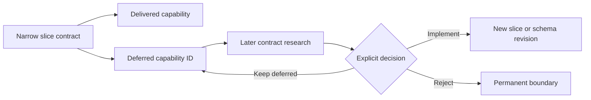

# Deferred Capabilities Register

## Purpose

This register preserves capabilities deliberately excluded from each Bounded Knowledge
slice so that a narrow version-1 contract does not make future possibilities disappear.
It is a planning index, not authorization to widen a detector or workflow.

## Status vocabulary

| Status | Meaning |
| --- | --- |
| `delivered-in-slice` | Planned during a slice handoff, then implemented and validated by that same slice |
| `delivered-later` | Excluded from the named slice, then implemented and validated by a later slice |
| `deferred` | Plausible future capability with no authorized implementation slice yet |
| `planned` | Assigned to the next contract-research slice, but its exact contract is not frozen |
| `permanent-boundary` | A safety or semantic prohibition, not a feature backlog item |

An entry records a capability class, not every syntax variant that could ever exist.
Detector-emitted gaps remain the instance-level evidence that a specific repository used
an unsupported form.

## Foundation and Slice 1: persisted deterministic boundaries

Governing contract: [`docs/contracts/slice-1.md`](../contracts/slice-1.md)

| ID | Capability excluded from Slice 1 | Status | Revisit condition or destination |
| --- | --- | --- | --- |
| `S1-D01` | Physical source resolution and trust approval | `delivered-later` | Delivered by Slice 2 |
| `S1-D02` | Maven/Gradle literal extraction and bounded evidence selection | `delivered-later` | Delivered by Slice 3 |
| `S1-D03` | Model-response extraction and evidence-bound candidate validation | `delivered-later` | Delivered by Slice 4 |
| `S1-D04` | Logical knowledge model and source topology | `delivered-later` | Delivered by Slice 5A |
| `S1-D05` | Human-review diff and approval workflow | `deferred` | Design after the manual pilot proves the candidate-to-catalog flow |
| `S1-D06` | Deterministic single-writer canonical promotion | `deferred` | Requires approved review semantics and rollback/audit rules |
| `S1-D07` | Conductor orchestration | `deferred` | Add only after the complete manual path is reliable |
| `S1-D08` | Runtime evidence ingestion | `deferred` | Requires a separate evidence contract, provenance, retention, and access decision |
| `S1-D09` | Manual private-repository pilot across the selected applications | `deferred` | Requires explicit repository selection and authorization after the deterministic detector chain is ready |
| `S1-D10` | Local website and bounded query layer over reviewed landscape artifacts | `deferred` | Design after the pilot establishes useful, supportable questions and safe local views |
| `S1-D11` | Landscape skill suite for guided inventory, review, and query workflows | `deferred` | Add only after the underlying commands and human workflow are stable |
| `S1-B01` | Model self-promotion into canonical knowledge | `permanent-boundary` | Human approval and deterministic validation must remain mandatory |

## Slice 2: source resolution

Governing contract: [`docs/contracts/slice-2.md`](../contracts/slice-2.md)

| ID | Capability excluded from Slice 2 | Status | Revisit condition or destination |
| --- | --- | --- | --- |
| `S2-D01` | Recursive resolution and hashing of instruction-file references | `deferred` | Requires a safe reference grammar, containment rules, cycle detection, and sensitive-target policy |
| `S2-D02` | Precise distinction between instruction references and unrelated `@` text such as email addresses | `deferred` | Revisit together with `S2-D01`; current behavior intentionally fails closed |
| `S2-D03` | Approval of user-level or environment-configured agent customizations | `deferred` | Requires a host-level trust artifact separate from repository registration |
| `S2-D04` | Direct bounded model execution after source approval | `delivered-later` | Synthetic read-only trial delivered by Slice 4; production workflow remains deferred |
| `S2-D05` | Live existence checks during registry-only validation | `deferred` | Keep structural registry review separate unless a new command explicitly combines it with resolution |
| `S2-B01` | Treating nested folders as independent Git roots without an actual repository boundary | `permanent-boundary` | Logical subpaths belong to source topology, not source registration |

## Slice 3: manifest extraction and evidence selection

Governing contract: [`docs/contracts/slice-3.md`](../contracts/slice-3.md)

| ID | Capability excluded from Slice 3 | Status | Revisit condition or destination |
| --- | --- | --- | --- |
| `S3-D01` | Maven effective models, parent inheritance, interpolation, dependency/plugin management, active profiles, and lifecycle effects | `deferred` | Needs a deterministic non-executing model or explicitly approved external metadata source |
| `S3-D02` | Maven transitive dependency resolution | `deferred` | Requires dependency metadata and network/cache provenance without executing source builds |
| `S3-D03` | Full Groovy/Kotlin Gradle parsing | `deferred` | Requires a safe parser that does not execute scripts |
| `S3-D04` | Gradle version catalogs, platforms, project dependencies, named maps, composite builds, and plugin/dependency-resolution management | `deferred` | Add only through exact contractually supported forms |
| `S3-D05` | Semantic or relevance-ranked evidence selection | `deferred` | Requires deterministic ranking and explicit protection against path-order omissions |
| `S3-D06` | Evidence-bundle kind bound directly to approved source resolution instead of manifest fallback | `deferred` | Integrate source-resolution artifacts into evidence selection |
| `S3-D07` | Evidence bundles larger than the current file, range, line, and byte limits | `deferred` | Revise only with measured need, cost, and privacy impact |
| `S3-B01` | Executing Maven, Gradle, wrappers, plugins, hooks, or source-owned code to discover metadata | `permanent-boundary` | Discovery remains static and read-only |

## Slice 4: candidate validation and direct model trial

Governing contract: [`docs/contracts/slice-4.md`](../contracts/slice-4.md)

| ID | Capability excluded from Slice 4 | Status | Revisit condition or destination |
| --- | --- | --- | --- |
| `S4-D01` | Human review UI or canonical diff | `deferred` | Design after the manual multi-application pilot |
| `S4-D02` | Canonical catalog promotion and rollback | `deferred` | Requires `S1-D05` and a deterministic single writer |
| `S4-D03` | Conductor sequencing, retries, budgets, and approval gates | `deferred` | Requires a proven manual workflow |
| `S4-D04` | Candidate types beyond the repository profile | `deferred` | Add per entity/relationship contract as detector and pilot needs become concrete |
| `S4-D05` | Production model execution across registered private repositories | `deferred` | Requires pilot selection, approved bounded evidence, host trust controls, and explicit authorization |
| `S4-B01` | Giving the cartographer write, shell, broad path, remote-session, or unbounded MCP access | `permanent-boundary` | Model analysis remains bounded and read-only |
| `S4-B02` | Trusting extracted JSON without deterministic validation | `permanent-boundary` | Extraction is syntactic and never establishes trust |

## Slice 5A: canonical knowledge model

Governing contract:
[`docs/contracts/slice-5a-knowledge-model.md`](../contracts/slice-5a-knowledge-model.md)

| ID | Capability excluded from Slice 5A | Status | Revisit condition or destination |
| --- | --- | --- | --- |
| `S5K-D01` | Interfaces and contract elements in the canonical catalog | `deferred` | Revisit after API/Kafka observations are reconciled in the manual pilot |
| `S5K-D02` | Modules and package architecture classifications | `deferred` | Requires dedicated deterministic evidence and reviewed classification contracts |
| `S5K-D03` | Data stores | `deferred` | Requires migration/configuration detectors and ownership semantics |
| `S5K-D04` | Kubernetes, Terraform, AWS, and other infrastructure resources | `deferred` | Requires infrastructure detector slices and reviewed application bindings |
| `S5K-D05` | Teams and stewardship | `deferred` | Requires an authoritative human or curated source; never infer solely from paths |
| `S5K-D06` | Findings, risks, pains, and opportunities | `deferred` | Requires evidence/counterevidence, decision state, and human review contracts |
| `S5K-D07` | Runtime observations | `deferred` | Requires the separate runtime evidence capability `S1-D08` |
| `S5K-D08` | Co-change history and causal/coupling interpretation | `deferred` | Requires history inputs, confounder filtering, and explicit non-causal wording |
| `S5K-D09` | Binding catalog evidence to selected excerpts and validating line containment | `deferred` | Extend cross-artifact validation before promotion |
| `S5K-D10` | Candidate-to-catalog transformation and single-writer promotion | `deferred` | Requires human review and promotion design |
| `S5K-B01` | An `unused` state inferred from static absence | `permanent-boundary` | Only scoped static terms such as `unreferenced-in-scope` are allowed |

## Slice 5A: source topology

Governing contract:
[`docs/contracts/slice-5a-source-topology.md`](../contracts/slice-5a-source-topology.md)

| ID | Capability excluded from Slice 5A topology | Status | Revisit condition or destination |
| --- | --- | --- | --- |
| `S5T-D01` | Filesystem resolution, symlink containment, and existence checks for source selections | `deferred` | Add a command that consumes an approved source-resolution artifact |
| `S5T-D02` | File/glob selectors inside a source selection | `deferred` | Requires a portable safe selector grammar and overlap rules |
| `S5T-D03` | Explicit precedence and replacement rules for inferred versus reviewed bindings | `deferred` | Define alongside human review and promotion |
| `S5T-D04` | Topology targets beyond applications and deployables | `deferred` | Add only after the catalog models the target entity type |
| `S5T-D05` | Automatic ownership confirmation from folder conventions | `deferred` | Folder conventions may propose inferred bindings but require review |
| `S5T-B01` | Machine-specific absolute paths in canonical topology | `permanent-boundary` | Absolute paths remain local in `sources.json` |

## Slice 6: OpenAPI and AsyncAPI inventory

Governing contract:
[`docs/contracts/slice-6-api-inventory.md`](../contracts/slice-6-api-inventory.md)

| ID | Capability excluded from Slice 6 | Status | Revisit condition or destination |
| --- | --- | --- | --- |
| `S6-D01` | OpenAPI and AsyncAPI YAML parsing | `deferred` | Requires a safe parser/dependency decision; conventional YAML filenames currently produce explicit gaps |
| `S6-D02` | OpenAPI 2/Swagger and specification versions outside the supported 3.0-3.2 policy | `deferred` | Add through an explicit version-policy revision and fixtures |
| `S6-D03` | AsyncAPI versions outside supported 2.x and 3.x policies | `deferred` | Add through an explicit version-policy revision and fixtures |
| `S6-D04` | Components, schemas, messages, and general `$ref` inventory | `deferred` | Define reference identity and non-resolution semantics first |
| `S6-D05` | Local or remote `$ref` resolution | `deferred` | Requires containment, cycle, network, and provenance rules; remote resolution may remain prohibited |
| `S6-D06` | OpenAPI callbacks, webhooks, links, and non-path operation surfaces | `deferred` | Add each structural surface through explicit vocabulary and line-location tests |
| `S6-D07` | AsyncAPI bindings, servers, parameters, traits, and message payload detail | `deferred` | Requires dedicated bounded observation forms |
| `S6-D08` | Provider implementation and consumer-reference reconciliation | `deferred` | Requires source detectors and scoped reconciliation after declarations are stable |
| `S6-D09` | Runtime reachability or usage | `deferred` | Belongs to runtime evidence, not static API inventory |
| `S6-B01` | Treating static absence as runtime non-use | `permanent-boundary` | Preserve `unknown` or `unreferenced-in-scope`, never `unused` |

## Slice 7: Kafka literal inventory

Governing contract:
[`docs/contracts/slice-7-kafka-inventory.md`](../contracts/slice-7-kafka-inventory.md)

| ID | Capability excluded from Slice 7 | Status | Revisit condition or destination |
| --- | --- | --- | --- |
| `S7-D01` | Kafka configuration in YAML, JSON, XML, build scripts, arbitrary properties, or generic text | `deferred` | Add one serialization and exact candidate/key family at a time |
| `S7-D02` | Full Java, Kotlin, or Java-properties parsing | `deferred` | Requires safe parsers or a larger exact lexical contract without source execution |
| `S7-D03` | Multiline constructs, escaped literals, Java text blocks, Kotlin raw strings, and Unicode escape preprocessing | `deferred` | Add with language-accurate line and literal semantics |
| `S7-D04` | Constant propagation, property lookup, placeholders, SpEL, concatenation, functions, and control/data-flow analysis | `deferred` | Requires deterministic resolution and explicit uncertainty behavior |
| `S7-D05` | Wildcard, static, aliased, and fully qualified imports; type aliases; inferred receiver types; cross-file bindings | `deferred` | Requires safe name/scope resolution and ambiguity handling |
| `S7-D06` | `TopicBuilder`, direct Kafka producers, `ProducerRecord`, `sendDefault`, Kafka Streams, helper wrappers, and custom producer APIs | `deferred` | Add each Kafka-specific context as a separate exact form |
| `S7-D07` | Listener patterns, partitions, multiple positive topics, positional arguments, custom listener annotations, and other consumer registrations | `deferred` | Requires explicit representation for patterns/partitions and bounded multi-topic identity |
| `S7-D08` | Configuration keys beyond `spring.kafka.template.default-topic` | `deferred` | Freeze each key family's exact static meaning before support |
| `S7-D09` | Schema IDs, registry URLs, serializer inference, registration, compatibility, and Avro/JSON Schema/Protobuf content | `deferred` | Requires schema identity, sensitive URL handling, and non-network semantics |
| `S7-D10` | Column-level occurrence identity | `deferred` | Needed only if identical references on the same path and line must remain distinct; version 1 collapses them |
| `S7-D11` | Topic/schema reconciliation across repositories | `deferred` | Requires registered scope, compatible identities, gaps, and human review |
| `S7-D12` | Broker or registry runtime observation | `deferred` | Requires runtime evidence contracts and explicit network authorization |
| `S7-B01` | Inferring producer/consumer execution, topic existence, ownership, delivery guarantees, business meaning, or runtime topology from literals | `permanent-boundary` | Static observations remain syntactic evidence only |

## Slice 8: container-image inventory

Governing contract:
[`docs/contracts/slice-8-container-image-inventory.md`](../contracts/slice-8-container-image-inventory.md)

| ID | Candidate capability | Status | Contract question |
| --- | --- | --- | --- |
| `S8-P01` | Literal Dockerfile `FROM` external-image references | `delivered-in-slice` | Delivered through the exact case-sensitive filename and physical-line grammar allowlist |
| `S8-P02` | Literal tags, digests, `scratch`, and `AS` aliases | `delivered-in-slice` | Exact strings are preserved; scratch and earlier stage identity remain distinct |
| `S8-P03` | `--platform`, build arguments, interpolation, continuation lines, and escape directives | `delivered-in-slice` | Delivered as explicit fixed-code gaps and fail-closed suppression, not positive interpretation |
| `S8-P04` | Later-stage `FROM` references (split from the original combined `COPY --from` planning item) | `delivered-in-slice` | Earlier exact aliases in later `FROM` are delivered; `COPY --from` remains deferred as `S8-D01` |
| `S8-P05` | Docker Compose image/build references | `deferred` | Requires an exact serialization and conventional candidate boundary |
| `S8-P06` | Kubernetes JSON workload image references | `deferred` | Requires a complete conventional candidate and workload-shape boundary |
| `S8-P07` | Kubernetes YAML parsing and multi-document manifests | `delivered-later` | Delivered by Slice 9 through pinned safe PyYAML node/event parsing and fixed resource limits |
| `S8-P08` | Helm templates/values and Kustomize bases, overlays, and image transforms | `deferred` | Requires template/reference semantics without execution or remote resolution |
| `S8-P09` | Init, ephemeral, sidecar, Job, and CronJob container locations | `delivered-later` | Slice 9 covers init, ephemeral, and ordinary containers across its complete stable workload matrix, including Job and CronJob |
| `S8-P10` | Registry resolution, pullability, provenance, SBOM, signing, and vulnerability data | `deferred` | Separate future network/runtime/security evidence capability |
| `S8-D01` | Dockerfile `COPY --from` stage and external-image references | `deferred` | Requires an exact COPY grammar and stage/image ambiguity contract |
| `S8-D02` | Arbitrary Dockerfile names and full Dockerfile grammar, parser directives, options, continuations, heredocs, and argument resolution | `deferred` | Add only through explicit grammar revisions without executing Docker or BuildKit |
| `S8-B01` | Claiming an image is built, available, secure, deployed, running, healthy, or owned by an application from static literals | `permanent-boundary` | Requires independent runtime, security, or reviewed topology evidence |

## Slice 9: Kubernetes YAML workload images

Governing contract:
[`docs/contracts/slice-9-kubernetes-image-inventory.md`](../contracts/slice-9-kubernetes-image-inventory.md)

| ID | Candidate capability | Status | Contract question or boundary |
| --- | --- | --- | --- |
| `S9-P01` | Literal images in plain Kubernetes YAML selected through reviewed source topology | `delivered-in-slice` | Delivered with one explicit source selection and bounded safe node-level YAML parsing |
| `S9-P02` | Stable Pod, Deployment, StatefulSet, DaemonSet, ReplicaSet, Job, and CronJob workload paths | `delivered-in-slice` | Delivered as one complete workload matrix, including corresponding List forms |
| `S9-P03` | `containers`, `initContainers`, and `ephemeralContainers` image locations | `delivered-in-slice` | Delivered through independent structural inspection in every supported PodSpec |
| `S9-D01` | Kubernetes JSON workload images | `deferred` | The approved real-landscape serialization is YAML; no conventional JSON candidate boundary was established |
| `S9-D02` | Beta workload API versions, ReplicationController, PodTemplate, and custom workload CRDs | `deferred` | Add only through explicit versioned structural contracts; never guess PodSpec paths |
| `S9-D03` | KEDA `ScaledJob` workload images | `deferred` | The current landscape uses `ScaledObject`; `ScaledJob` requires an exact KEDA API and `jobTargetRef` contract |
| `S9-D04` | Helm, Kustomize, overlays, patches, templates, includes, and variable substitution | `deferred` | Requires separate provenance and non-executing resolution contracts |
| `S9-B01` | Inferring application ownership or runtime deployment from a Kubernetes selection or image literal | `permanent-boundary` | Bindings remain reviewed topology evidence; static declarations do not establish runtime state |

## Slice 10: Terraform and Terragrunt declared composition

Governing contract:
[`docs/contracts/slice-10-terraform-terragrunt-inventory.md`](../contracts/slice-10-terraform-terragrunt-inventory.md)

| ID | Candidate capability | Status | Contract question or boundary |
| --- | --- | --- | --- |
| `S10-P01` | Selection-scoped native Terraform `.tf` declaration inventory | `delivered-in-slice` | Delivered with `python-hcl2==8.1.4`, reviewed topology selection, bounded positioned-tree parsing, and fail-closed whole-line evidence disposition |
| `S10-P02` | Literal Terraform module sources and direct syntactic references | `delivered-in-slice` | Declared composition remains unresolved; direct references are inventory-only evidence |
| `S10-P03` | Bounded local `terragrunt.hcl` composition inventory | `delivered-in-slice` | Local source/include/dependency/input-key structure is inventoried while inheritance and values remain unresolved |
| `S10-D01` | Terraform JSON configuration (`.tf.json`) | `deferred` | Version 1 emits a filename-derived unsupported-serialization gap without reading content |
| `S10-D02` | Terragrunt include, dependency, function, input, and folder-name evaluation | `deferred` | Requires a separate non-executing evaluation and provenance contract; version 1 emits unresolved-composition gaps |
| `S10-D03` | Module implementation inspection and effective child-resource expansion | `deferred` | Requires explicit local/remote module-source selection, containment, version, integrity, and provenance rules |
| `S10-D04` | Terraform override precedence and effective configuration merging | `deferred` | Override files are labeled but never merged or given evaluated precedence |
| `S10-D05` | Generated Terraform outside recognized excluded trees | `deferred` | Generated provenance cannot be inferred safely from syntax or naming; use reviewed source exclusions |
| `S10-D06` | Terraform provider schemas, registry metadata, lock metadata, and module downloads | `deferred` | Requires separate network/cache provenance and authorization; version 1 performs no resolution |
| `S10-B01` | Reading Terraform state, plans, variable-value files, caches, dependency outputs, encrypted values, or secret values | `permanent-boundary` | Static discovery must exclude these inputs without reading them |
| `S10-B02` | Executing Terraform, Terragrunt, providers, modules, hooks, generators, or source-owned code | `permanent-boundary` | Discovery remains static, deterministic, non-executing, and read-only |
| `S10-B03` | Claiming effective resources, deployment, existence, ownership, access, health, security, cost, provenance, or runtime behavior from declarations | `permanent-boundary` | Module and Terragrunt composition remains syntactic evidence with explicit unknowns |

## Maintenance rule

Every future slice must update this register as part of its completion gate:

1. Add stable IDs for newly deferred capability classes and permanent boundaries.
2. Mark a planned entry `delivered-in-slice` when that slice implements and validates it,
   or mark an earlier deferral `delivered-later` when a subsequent slice does so; do not
   delete the historical entry.
3. Link each entry to its governing contract or planning handoff.
4. Keep instance-level unsupported syntax in detector observations; do not copy private
   repository values into this register.
5. Treat moving an item from `deferred` or `planned` into implementation as an explicit
   scope decision requiring contract research, fixtures, validation, and review.
6. Report register changes in the slice handoff and final changed-file list.

The register is intentionally conservative: inclusion here means “remember and evaluate
later,” not “implement automatically.”
