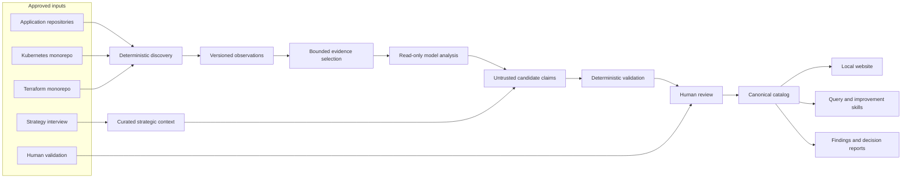
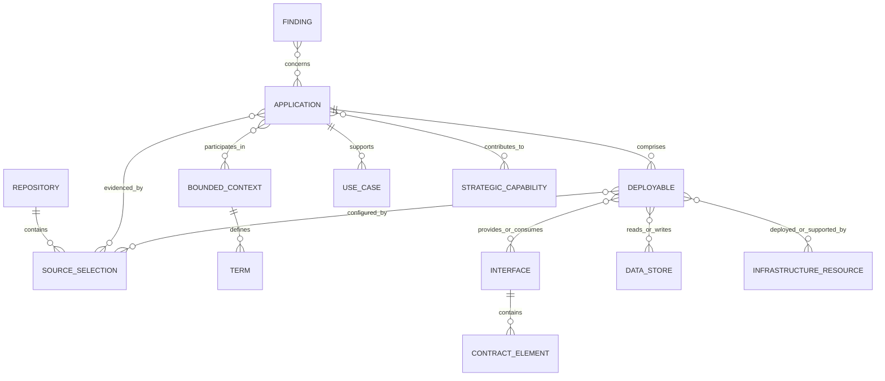
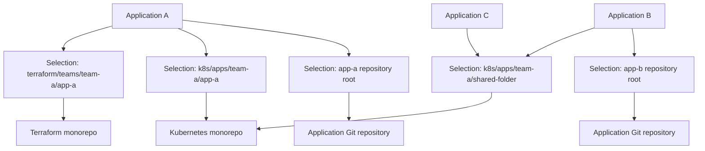
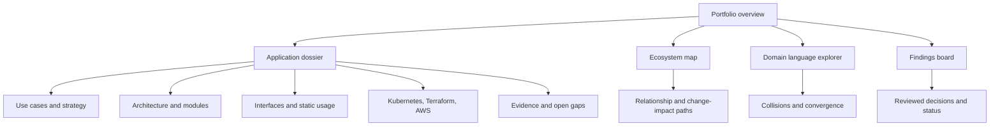
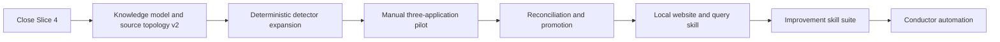

# Bounded Knowledge Landscape Plan

## Document control

| Field | Value |
| --- | --- |
| Status | Active working plan |
| Last updated | 2026-09-10 |
| Primary owner | Technical lead |
| Repository | `bounded-knowledge` |
| Purpose | Track the product vision, decisions, roadmap, progress, evidence policy, and open questions for the application-landscape initiative |

This is the durable strategic plan for the initiative. Detailed producer-consumer and CLI
contracts remain in `docs/contracts/`. Historical implementation context remains in
`docs/handoffs/`. This document records why the work exists, what outcome it must produce,
and whether implementation remains aligned with that outcome.

## Executive summary

The initiative will create a local, evidence-backed observatory for a landscape of
independently versioned applications and shared platform repositories. It must help a new
technical lead learn both the business domain and the technical ecosystem, relate that
knowledge to company strategy, and identify well-supported improvement opportunities.

The existing deterministic foundation is aligned with this goal: it establishes safe
source resolution, reproducible observations, bounded evidence selection, untrusted model
output, deterministic validation, and eventual human approval. The next milestone must
expand the product model before adding orchestration. In particular, it must distinguish
physical Git repositories from logical applications, deployables, monorepo subpaths,
interfaces, domain contexts, and infrastructure selections.

The initial analysis is static only. The system may report what a contract declares, what
a provider implements, and what registered consumers reference. It must not claim that a
contract element is used or unused at runtime.

## Context

- The primary user is joining a new team and has close to zero initial domain knowledge.
- The primary user is the technical lead and needs business, technical, and strategic
  understanding.
- Most applications use Java, with some Kotlin, primarily built with Gradle and
  occasionally Maven.
- Each application normally has an independent repository.
- Terraform and Kubernetes artifacts live in separate monorepositories.
- Folder naming normally indicates which application owns an infrastructure area.
- Exceptions exist: one infrastructure folder may describe more than one application.
- One logical application may contain multiple deployables, although the common case is
  one application to one deployable.
- The primary user supplies company-strategy context in an agreed format, potentially
  through an agent-led interview.
- The primary user validates terminology first and may confirm important definitions with
  domain experts.
- Model analysis should normally consume bounded evidence rather than entire repositories
  to control token use and reduce unsupported conclusions.

## Outcomes

The observatory must help answer these questions with evidence and explicit uncertainty:

1. What business purpose and use cases does each application support?
2. What ubiquitous language does each bounded context use?
3. Which terms collide, diverge, or converge across contexts?
4. What source and package architecture does each application use?
5. Which applications, deployables, interfaces, data stores, and infrastructure resources
   are related?
6. Which parts of a published contract are implemented and statically referenced by known
   consumers?
7. Which applications are candidates for coordinated change based on explicit
   relationships and repository history?
8. Which systems and capabilities support the company strategy supplied by the technical
   lead?
9. Where are the most important knowledge gaps, architectural pains, and improvement
   opportunities?
10. What evidence, counterevidence, and assumptions support every answer?

## Non-goals and safety boundaries

- Do not modify analyzed source repositories.
- Do not execute source-repository builds, tests, wrappers, hooks, plugins, or application
  scripts during discovery.
- Do not inspect or persist Terraform state, `.env` files, kubeconfigs, credentials,
  private keys, certificates, secret values, generated code, vendor trees, or build output.
- Do not evaluate Maven or Gradle effective models by executing build tooling.
- Do not treat folder naming as confirmed ownership without review.
- Do not treat absence of a static reference as proof that a contract element is unused.
- Do not infer company strategy from code.
- Do not recommend merging applications solely because their terminology overlaps.
- Do not make a database, graph, embedding index, or website the canonical source of truth.
- Do not allow a model to promote its own conclusions into canonical knowledge.

## Guiding principles

1. Deterministic tools produce observations; models interpret selected evidence.
2. Every semantic assertion is `confirmed`, `inferred`, or `unknown`.
3. Evidence and counterevidence remain separate.
4. Repository identity, full commit SHA, source path, and line range are recorded when
   practical.
5. Unsupported formats and unresolved mappings remain visible gaps.
6. Canonical knowledge is reviewable, version-controlled Markdown and JSON.
7. Generated sites, graphs, reports, and indexes are reproducible projections.
8. Read-only discovery may run in parallel; reconciliation and canonical promotion use a
   single writer.
9. Models receive the smallest evidence bundle that can answer the question reliably.
10. Human confirmation is part of the system, not an exception to it.

## Confirmed decisions

| Decision | Rationale | Status |
| --- | --- | --- |
| Repository artifacts are written in English | Provides consistent durable documentation | Confirmed |
| Source repositories remain independent and read-only | Preserves ownership and safety boundaries | Confirmed |
| The canonical store is version-controlled Markdown and JSON | Keeps knowledge reviewable and portable | Confirmed |
| GitHub Copilot CLI is the intended model execution environment | Keeps the workflow CLI-first and IDE-independent | Confirmed |
| Microsoft Conductor is an orchestration layer only | Parsing and domain logic belong in tested tools | Confirmed |
| Strategy context is initially supplied by the technical lead | Code cannot establish strategic intent | Confirmed |
| Strategy capture may use an agent-led interview | Reduces the burden of authoring a complete model upfront | Confirmed |
| Application and deployable are separate identities | One application may have several deployables | Confirmed |
| Initial contract-usage analysis is static only | Runtime telemetry is not currently in scope | Confirmed |
| Model work should normally use bounded evidence | Controls token use and limits unsupported exploration | Confirmed |
| The technical lead is the initial terminology approver | Enables a small pilot before wider governance | Confirmed |
| Important terminology may be checked with domain experts | Reduces the risk of codifying a local misunderstanding | Confirmed |
| Pilot applications have not yet been selected | Selection requires further discovery | Open |

## Target operating model

### Execution responsibilities

| Layer | Owns | Must not own |
| --- | --- | --- |
| Deterministic tools | Git metadata, file inventory, literal manifests, exact references, schemas, evidence selection, validation, caching | Business meaning or unsupported architectural conclusions |
| Model agents | Purpose candidates, use-case candidates, terminology, ambiguous relationships, architecture classification, improvement hypotheses | Source mutation or canonical promotion |
| Human review | Business meaning, terminology acceptance, exceptions, strategic relevance, final decisions | Reconstructing basic deterministic facts manually |
| Conductor | Sequencing, routing, checkpoints, retries, cost limits, human gates | Parsing, scoring, domain logic, or hidden catalog mutation |

## Target knowledge model

### Core entities

| Entity | Meaning |
| --- | --- |
| `Repository` | One physical Git root, history, and trust boundary |
| `SourceSelection` | A logical subtree or file selection within a repository |
| `Application` | A business or operational system recognized by the organization |
| `Deployable` | An independently deployed workload, job, function, or scheduled process |
| `Module` | A Maven, Gradle, or source-level module within a repository |
| `BoundedContext` | A boundary within which domain terms have consistent meanings |
| `UseCase` | A business outcome or actor goal supported by an application |
| `Term` | A context-specific domain expression and definition |
| `Interface` | A contract exposed to or consumed by another system |
| `ContractElement` | An endpoint, operation, message, field, topic, schema, or event type |
| `DataStore` | A logical database, schema, bucket, cache, or similar store |
| `InfrastructureResource` | A Kubernetes, Terraform, or AWS-related resource observation |
| `Team` | A reviewed ownership or stewardship identity |
| `StrategicCapability` | A company capability or strategic objective supplied through curated context |
| `Finding` | An evidence-backed pain, risk, opportunity, or question requiring action |

### Key relationships

Every relationship is itself evidence-backed. Folder conventions, string matches, and
model interpretations create candidate relationships; they do not bypass review.

## Source topology

Physical repository registration and logical application mapping must be separate.

### Registry responsibilities

- `sources.json` remains a local, user-owned registry of physical Git roots and absolute
  machine paths.
- A repository entry points to the monorepo root, never to a nested folder pretending to
  be an independent repository.
- A future source-topology contract records `repositoryId`, safe relative `subpath`, kind,
  selectors, and exclusions.
- Canonical application-to-selection bindings use stable IDs and relative paths, not
  machine-specific absolute paths.
- Naming conventions may propose bindings with `inferred` status.
- Explicit reviewed mappings override naming conventions.
- Many-to-many bindings support shared folders and multi-deployable applications.

## Evidence model

### Evidence classes

| Class | Examples | Initial handling |
| --- | --- | --- |
| Source | Java, Kotlin, configuration, migrations | Deterministic inventory plus bounded selection |
| Build | Gradle and Maven manifests | Literal extraction; dynamic/effective constructs remain gaps |
| Interface | OpenAPI, AsyncAPI, Avro, JSON Schema, Proto, Kafka configuration | Deterministic contract and reference observations where supported |
| Deployment | Kubernetes, Helm, Kustomize, Docker | Deterministic resource and exact-reference observations |
| Infrastructure | Terraform modules, resources, variables, outputs, explicit references | Static inspection only; Terraform state is excluded |
| Change history | Git commits, paths, timestamps, reviewed issue identifiers | Co-change candidates with confounder filtering |
| Strategy | Structured interview supplied by the technical lead | Curated human-authored evidence |
| Human knowledge | Terminology and relationship confirmation | Timestamped approval or correction |
| Runtime | Logs, traces, metrics, service mesh, runtime schema use | Out of scope for the initial plan |

### Static contract-usage vocabulary

The initial system uses these terms precisely:

| State | Meaning |
| --- | --- |
| `declared` | Present in a published contract or configuration |
| `implemented` | Provider source contains evidence of implementing it |
| `referenced` | A registered consumer contains a static reference to it |
| `unreferenced-in-scope` | No static reference was found in the repositories and forms actually analyzed |
| `unknown` | Evidence is missing, unsupported, dynamic, ambiguous, or outside the registered scope |
| `runtime-observed` | Reserved for a future runtime-evidence capability and unavailable in the initial plan |

The system must never translate `unreferenced-in-scope` into `unused`. A contract-shrink
finding must name the analyzed repositories, commits, supported reference forms, excluded
evidence, and remaining uncertainty.

### Static co-change interpretation

Cross-repository history may produce candidates such as "these applications often change
within the same time window." It does not prove causal coupling. Analysis should account
for dependency-update bots, mass formatting, release trains, repository migrations, and
company-wide changes. Confidence increases when temporal proximity is supported by a
shared interface, issue identifier, domain term, or reviewed human explanation.

## Strategy input

Strategy is a curated input, never a code inference. The first version will be supplied by
the technical lead through a structured document or agent-led interview.

### Proposed strategy record

| Field | Purpose |
| --- | --- |
| `id` | Stable identifier |
| `name` | Human-readable objective or capability |
| `type` | `objective`, `capability`, `principle`, `constraint`, or `initiative` |
| `statement` | Concise agreed meaning |
| `desiredOutcomes` | Observable outcomes the strategy seeks |
| `timeHorizon` | Relevant period, if known |
| `priority` | Human-supplied relative priority |
| `source` | Interview, supplied document, or approved reference |
| `suppliedBy` | Person or role providing the context |
| `recordedAt` | Timestamp of capture |
| `openQuestions` | Missing or disputed context |

An agent may interview the technical lead to populate this format. The resulting artifact
must be reviewed before applications are mapped to it. Application-to-strategy mappings
are separate claims with their own evidence and approval.

## Architecture and domain analysis

### Package architecture classification

The system should propose, not assume, patterns such as:

- package by layer;
- package by feature;
- hexagonal or ports-and-adapters;
- clean/onion architecture;
- vertical slices;
- modular monolith;
- mixed or indeterminate structure.

Deterministic tooling reports package paths, dependency direction indicators, framework
annotations, build modules, and exact references. A model classifies the likely pattern
from selected evidence and records counterevidence and exceptions. Mixed architectures
must remain visible instead of being forced into one label.

### Ubiquitous language

Terms are context-specific. Two applications using the same word do not automatically
share a model, and two different words may describe the same business concept.

Collision candidates include:

- same term, different meaning;
- different terms, apparently equivalent meaning;
- one term used at different abstraction levels;
- implementation name diverging from approved business language;
- shared contract using a term owned differently by producer and consumer.

Terminology convergence is evidence for investigation, not by itself a reason to merge
applications. Merge recommendations must also consider ownership, use cases, lifecycle,
data authority, operational independence, change patterns, and strategic direction.

## Local website

The website is a generated local projection of validated canonical knowledge.

### Initial views

1. Portfolio overview with purpose, ownership, strategic capability, evidence freshness,
   confidence, and major gaps.
2. Application dossier with use cases, deployables, modules, contexts, terms, interfaces,
   data stores, infrastructure, findings, and evidence.
3. Typed ecosystem map with filters for relationship type and confidence.
4. Contract matrix comparing provider declarations, implementation evidence, and static
   consumer references.
5. Domain language explorer showing context-specific definitions, synonyms, collisions,
   and unresolved terms.
6. Infrastructure view connecting applications and deployables to Kubernetes and
   Terraform selections and statically identifiable AWS resources.
7. Co-change and impact view that distinguishes evidence from hypotheses.
8. Findings board ordered by value, pain, confidence, counterevidence, and decision state.
9. Evidence drawer linking every claim to repository, commit, path, and lines.

The existing `graphify-out/graph.html` is an exploratory view of this observatory's code
and documentation. It is not the landscape website or a canonical input.

## Agent skill strategy

Skills should consume validated catalog data or bounded evidence through documented
commands. They should return structured claims, citations, counterevidence, and open
questions.

| Skill | Responsibility |
| --- | --- |
| `landscape-query` | Answer general ecosystem questions with evidence and uncertainty |
| `application-dossier` | Summarize one application across business, source, interfaces, deployment, and infrastructure |
| `domain-language-reconciler` | Compare terms across contexts and propose collision or convergence candidates |
| `relationship-investigator` | Explain or challenge a relationship between systems |
| `contract-usage-analyzer` | Compare declared, implemented, and statically referenced contract elements |
| `change-impact-analyzer` | Trace a proposed change through supported relationships |
| `co-change-investigator` | Combine repository history with technical evidence to identify coordinated-change candidates |
| `package-architecture-classifier` | Propose an architecture pattern with evidence and counterevidence |
| `infrastructure-mapper` | Connect deployables to Kubernetes, Terraform, and statically identified AWS resources |
| `architecture-improvement-finder` | Identify improvement opportunities within a selected evidence boundary |
| `strategy-alignment-reviewer` | Compare reviewed applications and capabilities with supplied strategy context |
| `evidence-auditor` | Challenge a conclusion's evidence quality and scope |

### Upstream Matt Pocock skills

- `domain-modeling` is a useful human-facilitation method, but its direct `CONTEXT.md`
  updates must be adapted into candidate output plus human-gated promotion.
- `codebase-design` supplies useful vocabulary for modules, interfaces, seams, depth,
  leverage, locality, adapters, and test surfaces.
- `improve-codebase-architecture` is appropriate for a selected application or subsystem,
  not for initial ecosystem discovery. Its source exploration, Git-history scan, subagent
  use, HTML generation, and possible glossary changes require a bounded read-only wrapper.
- Upstream skills must be reviewed and pinned to an explicit commit before operational use.

### Token controls

- Skip repositories whose analyzed commit has not changed.
- Perform deterministic filtering before model invocation.
- Select evidence by question and detector observation rather than sending whole
  repositories.
- Set explicit per-agent input, output, and selected-file limits.
- Use isolated per-repository candidates before cross-repository reconciliation.
- Reuse validated canonical claims instead of repeatedly interpreting the same source.
- Reserve stronger models for cross-context reconciliation, difficult ambiguity, and
  evidence auditing.
- Record unsupported evidence as a gap rather than expanding scope automatically.

## Roadmap

### Current status

| Milestone | Status | Evidence |
| --- | --- | --- |
| Foundation | Complete | Safe discovery, schemas, CLI contracts, synthetic fixtures |
| Slice 1: deterministic contracts | Complete and committed | Persisted contracts and validators |
| Slice 2: source resolution | Complete and committed | Physical Git-root resolution and Copilot customization approval |
| Slice 3: manifest extraction and evidence selection | Complete and committed | Literal Maven/Gradle observations and bounded evidence bundles |
| Slice 4: candidate validation | Complete and committed | Deterministic candidate and evidence binding; included in checkpoint `6eb9777` |
| Slice 4: direct Copilot trials | Blocked externally | Java and Kotlin inventories and evidence reproduce; Copilot CLI has no local authentication |
| Knowledge model and source topology v2 | Complete and committed | Strict schemas, representative fixtures, deterministic validators, and cross-artifact CLI validation; included in checkpoint `6eb9777` |
| Slice 6: OpenAPI and AsyncAPI inventory | Implemented and validated | Structural JSON operations, visible YAML gaps, independent review findings closed; 63 tests pass |
| Private pilot | Not started | Pilot applications are not yet selected |
| Canonical promotion | Not started | Requires reviewed target model and pilot |
| Local website | Not started | Information architecture defined in this plan |
| Landscape skill suite | Not started | Responsibilities defined in this plan |
| Conductor orchestration | Deferred | Automate only after the manual end-to-end path is reliable |

### Revised sequence

### Milestone 1: close Slice 4

- Complete direct read-only Copilot trials against both synthetic applications.
- Validate both candidate envelopes deterministically.
- Review the token size and usefulness of the selected evidence.
- Preserve `sources.json` as user-owned and separate it from implementation changes.
- Commit and push only after explicit authorization.

### Milestone 2: knowledge model and source topology v2

- Define contracts for the target entities and typed relationships.
- Separate physical repository roots from logical source selections.
- Support many-to-many application and deployable bindings.
- Represent inferred naming-based mappings and explicit reviewed overrides.
- Add fixtures for an ordinary one-to-one mapping and a shared-folder exception.
- Revise evidence bundles so source kind comes from reviewed resolution context rather
  than manifest fallback.

### Milestone 3: deterministic detector expansion

Implement small, fixture-tested detectors in this approximate order:

1. OpenAPI and AsyncAPI inventory.
2. Kafka topics, producers, consumers, and schema references.
3. Kubernetes, Helm, Kustomize, Docker, and image references.
4. Terraform modules, resources, outputs, and explicit references.
5. Java/Kotlin packages, Spring entry points, framework annotations, and module structure.
6. Database migration object names.
7. Git-history inputs for static co-change candidates.

Each detector must state supported forms and emit visible gaps for unsupported constructs.

### Milestone 4: manual pilot

Select three closely related applications plus their Kubernetes and Terraform selections.
Prefer a pilot that contains:

- two ordinary one-application folders;
- one shared or exceptional infrastructure folder;
- at least one synchronous interface or asynchronous message relationship;
- terminology likely to expose a real context collision;
- enough source history to examine one co-change hypothesis.

Pilot acceptance criteria:

- three reviewed application dossiers;
- application-to-deployable and application-to-infrastructure mappings;
- 10-20 human-validated terms;
- 5-10 human-validated relationships;
- one contract usage matrix with static-only wording;
- one architecture classification per application, including counterevidence;
- one co-change candidate accepted or rejected after review;
- one improvement finding accepted, rejected, or left explicitly unknown;
- every visible claim traceable to evidence or curated human input;
- measured model input/output size per analysis stage.

### Milestone 5: reconciliation and promotion

- Add deterministic candidate validation for all new entity and relationship types.
- Add human review with a visible canonical diff.
- Promote through a single deterministic writer.
- Reconcile terms and relationships sequentially.
- Never replace contradictory claims silently; retain evidence and counterevidence.

### Milestone 6: local website and query layer

- Generate a static local site from canonical data.
- Provide the initial views described above.
- Add stable deep links from claims to evidence.
- Provide a bounded query command used by both the website and `landscape-query` skill.
- Keep website-specific indexes and graph data disposable.

### Milestone 7: improvement skills

- Implement the evidence auditor first.
- Add domain, relationship, contract, impact, architecture, and strategy skills gradually.
- Evaluate usefulness against pilot questions before widening source or token budgets.
- Adapt and pin upstream skills rather than invoking mutable upstream versions directly.

### Milestone 8: Conductor

- Review and pin a current Conductor release.
- Encode the proven single-repository and reconciliation flows as thin workflows.
- Include cost limits, checkpoints, human gates, and resumable failure handling.
- Keep parsing and domain logic in deterministic commands.

## Progress log

| Date | Progress | Validation or decision |
| --- | --- | --- |
| 2026-09-07 | Initial evidence-backed observatory architecture designed | Deterministic-first, read-only, human-gated approach selected |
| 2026-09-08 | Deterministic contracts and source resolution implemented | Slices 1 and 2 committed |
| 2026-09-09 | Literal Maven/Gradle extraction and evidence selection implemented | Slice 3 committed; source-repository execution remained prohibited |
| 2026-09-09 | Candidate validation and read-only cartographer prepared | Direct Copilot Java/Kotlin trials remained pending |
| 2026-09-10 | Original plan assessed against expanded business and technical objectives | Foundation retained; source topology, knowledge model, website, skills, and strategy input added before Conductor |
| 2026-09-10 | Initial planning decisions captured | Strategy is human-supplied; applications may have multiple deployables; initial usage analysis is static; evidence-bounded model work is preferred |
| 2026-09-10 | Deterministic suite revalidated | 40 tests passed |
| 2026-09-10 | Knowledge model and source topology v2 implemented through parallel contract work and central integration | Catalog owns logical entities and application-to-deployable relationships; topology owns repository selections and selection bindings |
| 2026-09-10 | Independent Slice 5A review completed and findings resolved | Closed schema-validator parity, dangling evidence-reference, and curated-strategy gaps; 49 tests passed |
| 2026-09-10 | Slice 4 synthetic trials prepared and reproduced | Java and Kotlin inventories and evidence bundles passed; direct Copilot calls failed closed because local authentication is absent |
| 2026-09-10 | First deterministic interface detector implemented through contract, implementation, and independent review stages | OpenAPI 3.0/3.1/3.2 and AsyncAPI 2.x/3.x JSON operations supported; YAML remains an explicit gap; 63 tests passed |

## Risks and mitigations

| Risk | Consequence | Mitigation |
| --- | --- | --- |
| Folder naming is treated as truth | Incorrect application ownership | Emit inferred candidates and support reviewed overrides |
| Repository, application, and deployable are conflated | Broken topology and misleading impact analysis | Preserve separate entity identities from the next schema revision |
| Static absence is labelled unused | Unsafe contract removal | Use `unreferenced-in-scope` and disclose analyzed scope and gaps |
| Model context grows with the landscape | High cost and degraded answers | Commit caching, deterministic selection, bounded tasks, canonical reuse |
| Business language is inferred from implementation names | Incorrect ubiquitous language | Capture strategy and terms through reviewable interviews and domain experts |
| Similar terminology drives premature mergers | Organizational or architectural damage | Require lifecycle, ownership, data, operational, change, and strategy evidence |
| Co-change correlation is mistaken for causation | Misleading coupling findings | Filter mechanical changes and seek relationship or human corroboration |
| Generated graph becomes canonical | Loss of auditability and unstable knowledge | Generate all projections from versioned catalog artifacts |
| Orchestration is added before the product model stabilizes | Automated rework and hidden coupling | Prove the manual pilot before Conductor |
| Upstream skills mutate source or drift over time | Safety violations or inconsistent analysis | Adapt, restrict, review, and pin them |

## Open questions

These questions do not block documenting the plan, but they affect later implementation:

1. Which three applications and infrastructure selections form the pilot?
2. What is the first agreed strategy-input format after testing the proposed record through
   an interview?
3. Which contract formats occur in the real pilot: OpenAPI, AsyncAPI, Avro, JSON Schema,
   Proto, or others?
4. Which application and deployable identifiers are already authoritative inside the
   company?
5. How should ownership exceptions be approved and who is authoritative for them?
6. What Git-history window and change proximity should generate an initial co-change
   candidate?
7. May evidence bundles include selected source text in canonical history, or should
   canonical claims retain references and digests only?
8. Which strategic objectives are safe and useful to record in this repository?
9. Which domain experts should confirm high-impact terms and relationships?
10. What model input/output budget is acceptable per application and per reconciliation
    run?

## Immediate next decision

Authenticate Copilot CLI locally and rerun the two already prepared Slice 4 commands to
close its final external gate. Review the deliberately narrow Slice 6 boundary before
choosing whether its next increment should parse YAML, inventory components and
references, or proceed to Kafka relationship observations. Conductor and promotion
remain deferred until the manual path is proven.
